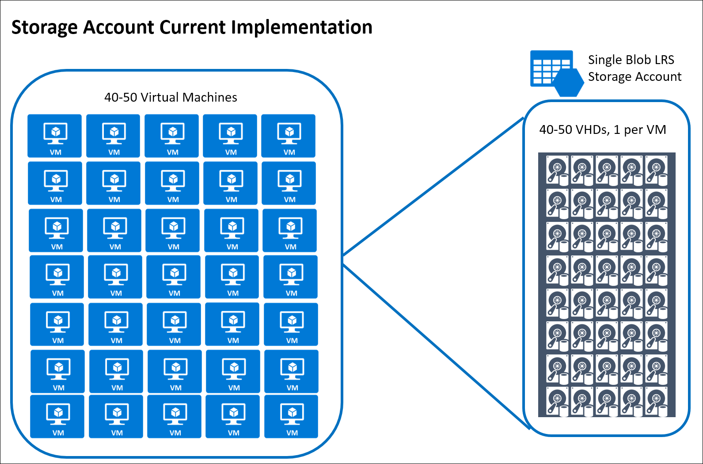
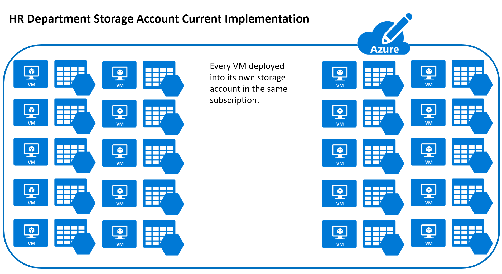
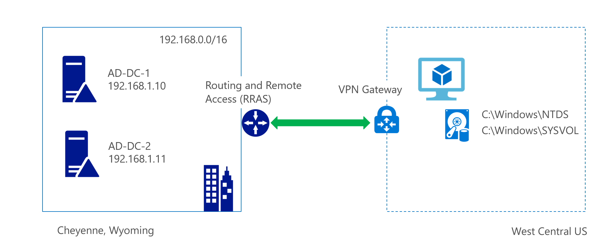
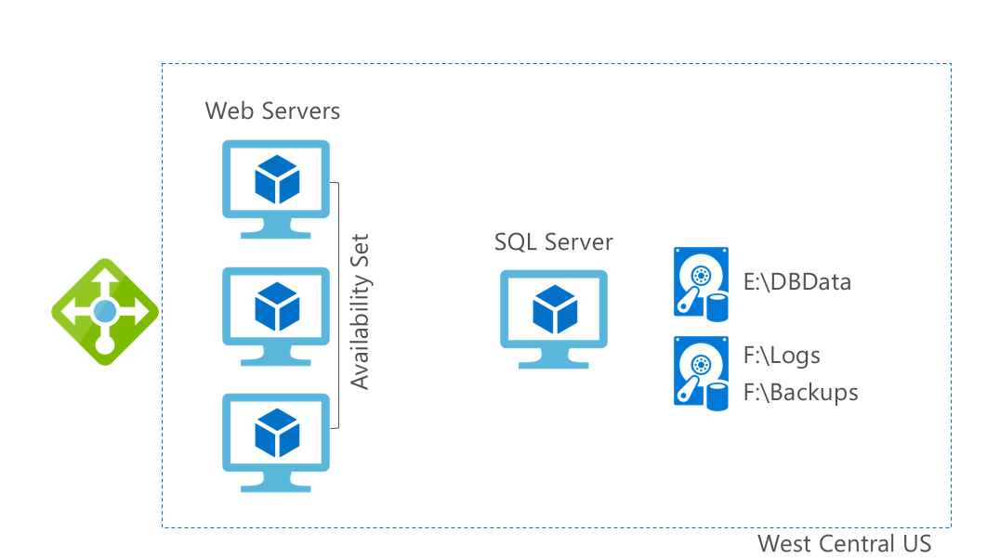

---
lab:
    title: 'Building a resilient IaaS architecture '
---

# Building a resilient IaaS architecture

**Contents**

<!-- TOC -->

- [Building a resilient IaaS architecture guide](#building-a-resilient-iaas-architecture-whiteboard-design-session-student-guide)
    - [Abstract and learning objectives](#abstract-and-learning-objectives)
    - [Step 1: Review the customer case study](#step-1-review-the-customer-case-study)
        - [Customer situation](#customer-situation)
        - [Customer needs](#customer-needs)
        - [Customer objections](#customer-objections)
        - [Infographic for common scenarios](#infographic-for-common-scenarios)
    - [Step 2: Design a proof of concept solution](#step-2-design-a-proof-of-concept-solution)
    - [Step 3: Present the solution](#step-3-present-the-solution)
    - [Wrap-up](#wrap-up)
    - [Additional references](#additional-references)

<!-- /TOC -->

#  Building a resilient IaaS architecture guide

## Abstract and learning objectives 

In this Case Study, you will look at how to design for converting/extending an existing IaaS deployment to account for resiliency and in general high availability. Throughout the whiteboard design session, you will look at the various configuration options and services to help build resilient architectures.

At the end of the Case Study, you will be better able to design and use resiliency concepts including High Availability with protection from hardware/rack failures with Availability sets, High Availability and Disaster Recovery for database tiers using SQL Always ON, Disaster Recovery for virtual machines to another region using Azure Site Recovery to meet RTO and RPO goals. In addition, you'll learn effective employment of Azure Backup to protect and secure your data against corruption and attacks.

## Step 1: Review the customer case study 

**Outcome** 

Analyze your customer’s needs.

Timeframe: 15 minutes

### Customer situation

Contoso, is a leading manufacturer, seller, distributor and servicer of parts for heating, venting and air-conditioning (HVAC) systems. Their customer base includes some of the largest corporations and independent firms in the US. Contoso specializes in the datacenter space, designing computer room air conditioning (CRAC) units and contracting in the planning of hyper-scale cloud provider datacenter cooling strategies. As such, the research and development group are one of the largest business units in the company. The company's headquarters in in Cheyenne, Wyoming with a second large location in Seattle, Washington along with three smaller branch offices scatted around the United States.

Contoso would be considered by most as a classic IT shop, mainly focused on their infrastructure. Their application development department's skill set is dated, predominantly focused on client/server development. Two years ago, the company began a project to move portions of their infrastructure to Azure to gain efficiencies and eventually exit the hardware obsolescence cycle. In the process Contoso developed a standard deployment policy for new infrastructure that has been followed ever since.

Their ordering system is running in Azure on virtual machines with a SQL Server data tier. For many years Contoso's ordering process was done mainly via phone by their sales team based in one of their offices. Recently, the company has moved to an Internet-based ordering system with Internet Information Services (IIS) web servers in Azure housing the front-end application for the ordering, invoicing, and support options. Customers have complained at times of intermittent problems/errors with the website.

There have been ongoing stability issues including a critical server running out of disk space. This along with recent stability issues with the ordering system prompted Contoso to perform a business impact analysis of the application. This exercise resulted in an executive mandate for a 4 hours recovery time objective (RTO) with a recovery point objective (RPO) of 6 hours for the data.

In addition to the ordering system, they have a legacy software program where the data is tightly coupled with the application. This program accesses a file server as well. Because of the time and effort required, a re-write of this application is not planned. The application is being backed up using a disk-to-disk-to-tape approach. The legacy application is running on aging hardware and a decision must be made as to whether to purchase new hardware, re-write the application, or move it as-is to Azure along with the fileserver.

Each of the branch offices are small enough to not require an on-site server infrastructure. These locations have connectivity to the Cheyenne headquarters through a Virtual Private Network (VPN). At times, various branch offices have experienced connectivity issues over the VPN to Cheyenne. While there is some understanding of these occurrences, there is a desire to increase the stability of the connection as growth continues.

Several years ago, under the leadership of Lewis Franklin, head of infrastructure and operations, individual departments started migrating their servers into Azure. The Active Directory Domain Services (ADDS) team has deployed several Domain Controller (DC) Virtual Machines (VM) to a virtual network in the West Central US region. This region was chosen due to its proximity to the Cheyenne Headquarters. Some effort was made to follow the guidance of Microsoft on the use of Active Directory (AD) in Azure, but some configuration gaps remain.

The web application team has also deployed the Ordering application within the same West Central US region. While they do not have administrative rights for the SQL VMs that provide database services for the web application, they do have database rights and can access the databases through normal SQL toolsets.

Taking their cue from the AD and Web teams, the Database Administrators have also rolled out their SQL servers onto Azure VMs, choosing to host them in the West Central US region as well.

The Marketing department has recently been tasked with moving their server workloads into Azure by rebuilding each application. They have begun building their servers utilizing a single Azure storage account. They have around 40-50 VMs already but anticipate continued growth.

*Figure 2 -- Contoso's Storage Account Configuration*

Contoso is connected via a Windows Server Routing and Remote Access Service (RRAS) VPN connection to Azure via a Site-to-Site Gateway. They are looking for options to provide redundancy for the hybrid connectivity to Azure due to recent network issues.

While the Azure deployments have served Contoso well so far, they are concerned about expanding workloads for their Seattle datacenter. Janet Lewis, business continuity team director, says, "it appears that while services have moved to the cloud, the overall paradigm has not moved from the single datacenter model we have always deployed."

Over a recent three-day holiday weekend, there was an incident with one of the ADDS Domain Controllers where the disk drive housing the AD database filled up and corrupted the database. This prompted a high-priority support call to Microsoft. While the damage was mitigated, the team was fortunate that the consequences were minimal.

Retroactively, checks were made on other Azure VM disk drives and there were several of them that were getting close to capacity due to teams not proactively monitoring their servers. Management is now calling for a proactive approach to monitoring operating system (OS) disk and data disk free space as well as other key metrics in the environment.

The Human Resources department has requested that IT move their server workloads into Azure and this process has begun. Their organization has a pre-existing policy that they create a new storage account for each VM in the subscription. They have deployed about 40-50 VMs but anticipate growth that will more than double the size of their deployment numbers.

Richard Wade, infrastructure lead, is researching options for making the overall Azure infrastructure more resilient; including looking at technologies to help recover from an Azure region-wide outage. He also is interested in protecting against data corruption or accidental deletion of data or VMs.

For the current ADDS implementation in Azure, the team has deployed a single domain controller in the West Central US region. It is running on a Standard D1 instance with Active Directory deployed on the C: drive.

Additionally, the SQL Server VM and Web site implementation are also housed at the same region. SQL has been deployed on a single VM with multiple disks. One disk is utilized for the data; the other disk is for backup and log file storage. The underlying storage account is configured for geo replication.

They have deployed a load balancer in front of the web servers and configured a default health probe to monitor the servers in the load balanced pool. When they need scalability, they manually configure another web server and often leave it running even after the need for additional capacity has passed.

Contoso's business critical applications include:
-   The authentication and authorization infrastructure.
-   The website with its SQL data tier, supporting both employees, customers and third-party manufacturing plants and factories. Use cases include:
    -   Employees: Sales lead tracking
    -   Customers: Search the catalog of inventory, order parts, schedule repairs and provide support
    -   Third-party manufacturing plants and factories: Supply manufacturing schedules to Contoso

### Customer needs 

1.  The IT department is using outdated guidance on Azure and they need updated guidance on current architectural and deployment best practices.

2.  They need assistance with enabling connectivity and authentication for new infrastructure that will be deployed for the Seattle office.

3.  Identify the infrastructure requirements that should be configured to provide redundancy and resiliency to the web servers and the database servers for the ordering application in order to protect them from system downtime and/or region wide outage.

4.  An automated mechanism for a quick recovery of the ordering application in the event of disaster.

5.  A plan for recovery from data corruption or accidental deletion for all of the other infrastructure.

6.  A functional storage policy in place for the anticipation of growth in Azure.

7.  Monitoring option for issues that may arise on the servers and in Azure.

### Customer objections 

1.  Cost is a huge concern for us. With looming infrastructure and server replacement costs, we want to avoid any unnecessary expenditures.

2.  Downtime is becoming more of an issue for us due to development and production environments not being separate. We need to separate these from one another to avoid outages.

3.  Bandwidth is becoming an issue for self-hosting our application's ordering system, support website, etc. We are concerned that the cloud maybe constrained as well.

4.  We are very concerned about the disk space issue that occurred earlier with our Active Directory Domain Services domain controller and nearly all of our Web Servers and Database Servers. Will this be addressed per the resiliency plan?

### Infographic for common scenarios

## Step 2: Design a proof of concept solution

**Outcome** 

Design a solution and prepare to present the solution to the target customer audience in a 15-minute chalk-talk format. 

Timeframe: 60 minutes

**Business needs**

Directions: Answer the following questions. 

1.  Who should you present this solution to? Who is your target customer audience? Who are the decision makers? 

2.  What customer business needs do you need to address with your solution?

**Design** 

Directions: Respond to the following questions.

The desired outcome is to have authentication deployed using best practices in both the Cheyenne and the Seattle regions for current and future application migration.

For the ordering web app, redundancy and protection in case of failure is the main goal for all components of the design and the application should tolerate a failure in either region. The design should include network resiliency, as well as backup and restore methods in case of failure of the physical or VMs.

Directions: Design the solution architecture by drawing it out, and separately provide insight into how you will address the following requirements. Identify the steps needed to implement a proof of concept for the proposed solution(s) as well as what would need to be demonstrated to stakeholders.

*Virtual Network design in Azure*

1.  Document and diagram how you will build redundant Virtual Networks for Contoso. Address the following design points:

    -   Must allow for connectivity between two regions close to the Cheyenne and Seattle data centers

    -   Address the need for redundancy and resiliency in the site-to-site VPN connectivity from Contoso's offices to Azure.

    -   How will you design the address space and subnets to support Contoso's requirements?

2.  Document what network security groups and rules should be put in place for protection. What ports would you open and why?

*Design for resiliency in Azure*

1.  What changes, if any, will be needed to provide resiliency for the AD servers? Diagram how many and where they need to be placed.

2.  How will you address the needs for resiliency and scalability with the ordering app?

3.  How will you automate the solution for a quick recovery of the ordering application in the event of disaster?

4.  Consider storage account resiliency. What would best suit the needs for Contoso virtual machines? LRS, GRS, RA-GRS? Document why you chose the option you did. Should they move to Managed Disks?

5.  How would you address the needs of the legacy application, what storage tier and limitations do you have to work around? What SLA can Azure provide for this single instance VM?

6.  Provide Contoso with documentation concerning service limitations, quotas, subscription limits.

7.  What would you recommend Contoso enable for monitoring their environment?

**Prepare**

Directions: 

1.  Identify any customer needs that are not addressed with the proposed solution.

2.  Identify the benefits of your solution.

3.  Determine how you will respond to the customer’s objections.

##  Additional references

|    |            |
|----------|:-------------:|
| **Description** | **Links** |
| Microsoft Azure Reference Architectures| <https://docs.microsoft.com/azure/guidance/guidance-architecture> |
| Azure Resiliency Overview | <https://azure.microsoft.com/features/resiliency/> |
| High availability checklist | <https://docs.microsoft.com/azure/resiliency/resiliency-high-availability-checklist> |
| Azure resiliency technical guidance | <https://azure.microsoft.com/documentation/articles/resiliency-technical-guidance/> |
| Introduction to Active Directory Domain Services (AD DS) Virtualization (Level 100) | <https://docs.microsoft.com/windows-server/identity/ad-ds/introduction-to-active-directory-domain-services-ad-ds-virtualization-level-100> |
| Running your AD in Windows Azure | <https://docs.microsoft.com/azure/architecture/reference-architectures/identity/adds-extend-domain> |
| Running VMs for an N-tier architecture on Azure | <https://docs.microsoft.com/azure/guidance/guidance-architecture> |
| Azure Managed Disks | <https://azure.microsoft.com/en-us/services/managed-disks/> <https://docs.microsoft.com/en-us/azure/storage/storage-managed-disks-overview> |
| Azure Subscription and Service Limits | <https://docs.microsoft.com/azure/azure-subscription-service-limits> |
| Network Watcher and VPN Gateways | <https://docs.microsoft.com/azure/network-watcher/network-watcher-monitor-with-azure-automation> |
| High availability with VPN Gateway | <https://docs.microsoft.com/azure/vpn-gateway/vpn-gateway-highlyavailable> |
| Azure Backup documentation | <https://docs.microsoft.com/azure/backup/> |
