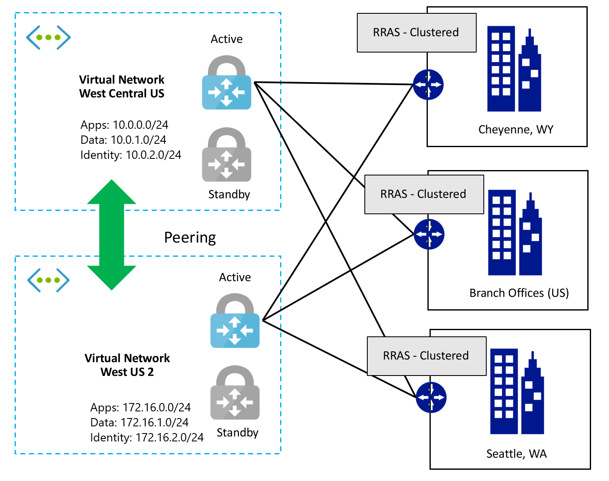
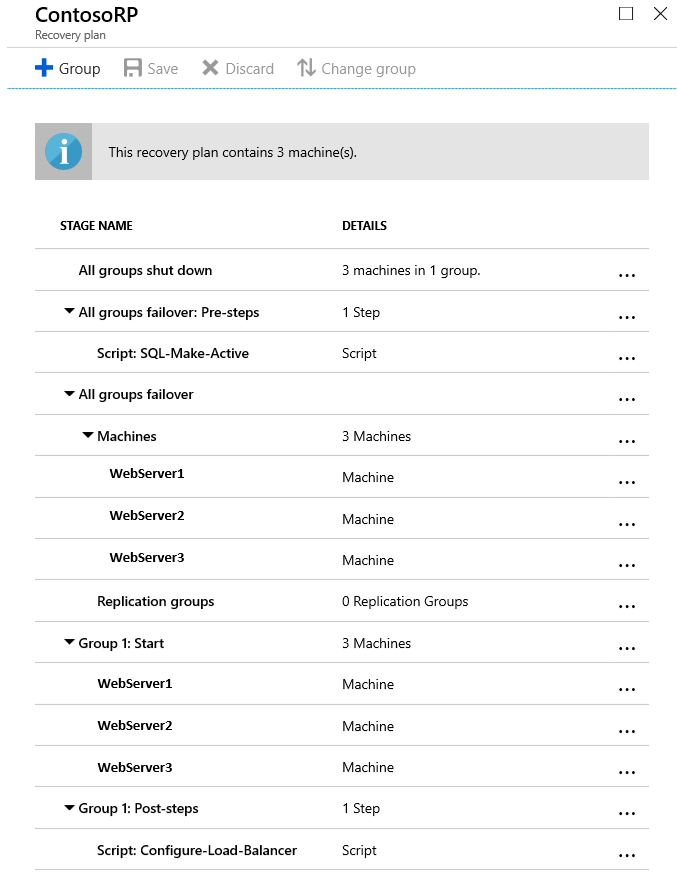

---
lab:
    title: 'Building a resilient IaaS architecture - Model Answer'
---

# Building a resilient IaaS architecture- Model Answer

## Preferred solution

*Virtual Network design in Azure*

1. Document and diagram how you will build redundant Virtual Networks for Contoso. Address the following design points:

    -   Must allow for connectivity between two regions close to the Cheyenne and Seattle data centers
    
    -   Address the need for redundancy and resiliency in the site-to-site VPN connectivity from Contoso's offices to Azure.
    
    -   How will you design the address space and subnets to support Contoso's requirements?

*Solution*

-   West Central US and West US 2 will be used due to their proximity to the Cheyenne and Seattle offices. Virtual Network Peering will be implemented for connectivity between the regions.
-   The Routing and Remote Access Servers (RRAS), should be configured using Windows Server Clustering so there is high availability on the on-premises site as well.
-   Address space and subnet design could use several combinations. Some example configurations:

    **West Central US (10.0.0.0/16)**

    -   Apps: 10.0.0.0/24
    -   Data: 10.0.1.0/24
    -   Identity: 10.0.2.0/24

    **West US 2 (172.16.0.0/16)**

    -   Apps: 172.16.0.0/24
    -   Data: 172.16.1.0/24
    -   Identity: 172.16.2.0/24

    

*Virtual Network Gateway configuration details*

-   You need to create multiple S2S VPN connections from each on-premises VPN device to Azure. When you connect multiple VPN devices from the same on-premises network to Azure, you need to create one local network gateway for each VPN device, and one connection from your Azure VPN gateway to the local network gateway.

-   The local network gateways corresponding to your VPN devices must have unique public IP addresses in the \"GatewayIpAddress\" property.

-   BGP is required for this configuration. Each local network gateway representing a VPN device must have a unique BGP peer IP address specified in the \"BgpPeerIpAddress\" property.

-   The AddressPrefix property field in each local network gateway must not overlap. You should specify the \"BgpPeerIpAddress\" in /32 CIDR format in the AddressPrefix field.

-   You should use BGP to advertise the same prefixes of the same on-premises network prefixes to your Azure VPN gateway, and the traffic will be forwarded through these tunnels simultaneously.

-   Each connection is counted against the maximum number of tunnels for your Azure VPN gateway, 10 for Basic and Standard SKUs, and 30 for the HighPerformance SKU.

Resilient benefits:

-   Providing route-based VPN gateways allows for the connection all three branch offices and the corporate office to connect via VPN. It also allows for the two regions to connect. There is even some room for growth and makes the connectivity resilient in case of some network event at the corporate office or a branch office.

-   Configuring Highly Available VPN can be done using RRAS VPN and Azure VPN Gateways and clustering them for VPN redundancy.
   
2. Document what network security groups and rules should be put in place for protection. What ports would you open and why?

   Network security groups (NSG) will be used to help secure the configuration by limiting traffic flow in a manner similar to a firewall rule. NSGs may be applied to either individual network interfaces or to a subnet. In Contoso's case there will be a single NSG applied to each subnet.

Address Spaces:

-   On-Premises: 192.168.0.0/16 (Domain Controllers: 192.168.1.10 & 192.168.1.11)
-   West Central US: 10.0.0.0/16 (Domain Controllers: 10.0.2.4 & 10.0.2.5)
-   West US 2: 172.16.0.0/16 (Domain Controller: 172.16.2.4 & 172.16.2.5)

Network Security Groups for the West Central US Virtual Network:

**Apps Tier NSGs** 

| Name | Priority | Source | Protocol | Source Port Range | Destination | Dest. Port Range | Action |
| :---|---:|---:|---:|---:|---:|---:|---:|   
|  HTTP     |        100      |      ANY            |  TCP    |        ANY        |             10.0.0.0/24   |    80         |            ALLOW |
|  HTTPS    |        110      |      ANY            |  TCP    |        ANY        |             10.0.0.0/24   |    443        |            ALLOW |
|  RDP      |        120      |      192.168.1.0/23 |  ANY    |        ANY        |             10.0.0.0/24   |    3389       |            ALLOW |

**Data Tier NSGs**

| Name | Priority | Source | Protocol | Source Port Range | Destination | Dest. Port Range | Action |
| :---|---:|---:|---:|---:|---:|---:|---:| 
|  SQLEXT   |        100         |   192.168.1.0/23  | TCP       |     ANY                  |   10.0.1.0/24     |  1433                |   ALLOW |
|  SQLINT   |        110        |    10.0.0.0/24    |  TCP       |     ANY                   |  10.0.1.0/24    |   1433                |   ALLOW |
|  RDP      |       120         |   192.168.1.0/23  | ANY        |    ANY                   |  10.0.1.0/24     |  3389                |   ALLOW |

**Identity Tier NSGs**

| Name | Priority | Source | Protocol | Source Port Range | Destination | Dest. Port Range | Action |
| :---|---:|---:|---:|---:|---:|---:|---:|
|  RDP           |       100          |  192.168.1.0/23 |  ANY          |  ANY                   |  10.0.2.0/24     |  3389                 |  ALLOW    |
|  ADDS Repl     |       110          |  192.168.1.10   |  ANY          |  ANY                   |  10.0.2.0/24     |  ANY                  |  ALLOW    |
|  ADDS Repl     |       120          |  192.168.1.11   |  ANY          |  ANY                   |  10.0.2.0/24     |  ANY                  |  ALLOW    |

**Network Security Groups for the West US 2 Virtual Network**

Since Contoso has not deployed any additional infrastructure to West US 2 the only ports needed are for administration and replication of Active Directory.

**Identity Tier NSGs**   
    
| Name | Priority | Source | Protocol | Source Port Range | Destination | Dest. Port Range | Action |
| :---|---:|---:|---:|---:|---:|---:|---:|                                                                                                       
|  RDP           |       100          |  192.168.1.0/23 |  ANY           | ANY                   |  172.16.2.0/24   |  3389         |          ALLOW    |
|  ADDS Repl     |       110          |  192.168.1.10   |  ANY           | ANY                  |   172.16.2.0/24   |  ANY          |          ALLOW    |
|  ADDS Repl     |       120          |  192.168.1.11   |  ANY           | ANY                  |   172.16.2.0/24   |  ANY          |          ALLOW    |

Resilient benefits:

-   Network security groups provide protection and only allow the traffic defined by the rules through. This protection is a form of resiliency as well.

-   External and internal protection is designed and provided for resiliency and hardening for the environment.

*Design for resiliency in Azure*

1.  What changes, if any, will be needed to provide resiliency for the AD servers? Diagram how many and where they need to be placed.

    *AD configuration details*

    -   Active Directory Domain Service (ADDS) Domain Controllers (DC) are deployed into Azure virtual machines. These are extensions of the on-premises AD DS DCs and allow for resiliency for the authentication and authorization mechanism that Contoso employees use today.
    
    -  Configure multiple VMs as Domain Controllers in the West Central U.S. region and two others in the West US 2. ADDS Sites and Services will be configured with the two Azure regional virtual networks as new sites in AD.
        -  For Domain Controllers in West Central US, Availability Sets will be configured.
        -  For Domain Controllers in West US 2, Availability Zones will be configured.
	
    -   All four DCs are in active state as a disaster recovery strategy. In case primary region is unavailable, requests are automatically served by secondary set of DCs.
    
    -   Each Domain Controller will be configured with a Data Disk for the ADDS database. To avoid any issue with the ADDS DB, this data disk needs to be configured with caching set to NONE.
    
    - 	Back-up the “system state” of two or more domain controllers in a domain-forest using Azure Backup MARS agent (Microsoft Azure Recovery Services Agent). 

    For details on restoring ADDS DCs see the following: 
    - https://azure.microsoft.com/en-us/blog/windows-server-system-state-backup-azure-ga/
    - http://techgenix.com/try-azure-backup-2/ 
    
    
    Resilient benefits:

    -   Storing the AD files on a data disk with caching set to None will keep the ADDS database and SYSVOL from any potential corruption due to caching.
    
    -   Adding DCs into an Availability Set will spread them across fault domains and update domains so that authentication and authorization servers are highly available and have an SLA of 99.95%.
    
    -   Adding DCs into an Availability Zone will spread them across datacenters within a region so that authentication and authorization servers are highly available and have an SLA of 99.99%.
    
    -   Deploying multiple DCs in multiple regions allows for redundancy in each region in the event of a regional Azure issue.
    
    -   AD native Replication across regions also allows for disaster recovery from region wide outage should the need arise and faster recovery of the ADDS database.
    
    -   Removing the DC that is not in an availability set helps avoid a single point of failure for that VM.
    
    -   System state contains the AD database, log files, the Windows registry, and the SYSVOL folder, which are critical in defining and maintaining the state of AD. MARS agent can be used for virtualized DCs, when implemented in-guest as well as on-premises DCs. Backing up an on-premises AD directly to the public cloud not only satisfies the requirement of creating an isolated fault domain for backups but also ensures that the same backup set up works if ever you transition to Azure.

    

2.  How will you address the needs for resiliency and scalability with the ordering app?

    *Web Server configuration details*

    The IIS Web Servers will be configured in the Apps Subnet and built on VMs. 

    Contoso's use of an Availability Set for the Web farm VMs should be applauded. Availability Sets provide protection and resiliency against unplanned and planned downtime. We configured the availability set to spread the VMs across **three** fault domains and **five** update domains. To minimize disruption, the application will remain in West Central US. Availability Zones are not available in all Azure regions, however as they are made available to more regions, Contoso can achieve an even higher level of resiliency by moving to them.

    A change of the Health Probe on the Load Balancer to use an HTTP health probe rather than a TCP probe is wise. The HTTP probe will monitor for HTTP code 200, indicating a healthy web site. If anything, other than a 200 is detected (such as the HTTP 500 the customers experienced), then that server will be removed from the rotation until the site is deemed healthy again.

    Replication to a secondary region West US 2 for web tier should be enabled to protect against the region wide outage and make the web tier resilient. In addition to this, Azure Traffic Manager can help further reduce RTO for external customers in case of a disaster.
    -  For web servers in West Central US, Availability Sets will be configured.
    -  For web servers in West US 2, Availability Zones will be configured. These web servers will be created post failover.
    
    For details on Azure Site Recovery replication process, see the following:
    https://docs.microsoft.com/en-us/azure/site-recovery/azure-to-azure-architecture

    Resilient benefits:

    -   Moving the Health Probe from TCP to HTTP on the load balancer gives a deeper more application centric view into the web server health. It will help avoid any intermittent problems that customers experienced in the past.
    -   Replication across regions also allows for disaster recovery from region wide outage should the need arise and faster recovery of the web tier.
    -   Adding web servers into an Availability Set will spread them across fault domains and update domains making them highly available with an SLA of 99.95%.
    -   Configuring web servers into an Availability Zone will spread them across datacenters within a region making them highly available with an SLA of 99.99% post failover (in case of disaster).

    *SQL Always-On configuration details*

    SQL Server is critical to the availability of the applications at Contoso. SQL will be implemented using a total of three Servers configured using Always-On Availability Groups. The two servers in West Central US comprise a single primary and a secondary, synchronously replica of the database. The two SQL servers will be deployed into an Azure availability set and are configured behind an internal load balancer which will allow client machines to connect to the listener which will direct traffic to the machines that is designated as the primary replica machine.

    The SQL Servers will use premium managed disks with a database and log files on separate disks. The TempDB will be housed on the local host SSD drive and split to match the number of cores in the VM.

    SQL Servers will have three drive letters: C:\\, F:\\ and G:\\

    | Drive  | Type      |  Purpose | 
    | ------- | ----------- | ----------------------------------------------------------- |
    | C:\\   | S10       | OS  | 
    | D:\\   | Local SSD  | TempDB broken into multiple files (match number of cores) |
    | F:\\   | P20        | SQL Database Files | 
    | G:\\   | P20        | SQL Database Log Files |

    >**Note**: Never use the E:\\ drive on an Azure VM as some Azure Regions have Host machines that contain DVD Drives.

    Azure Backup for SQL Server provides a solution that requires zero-infrastructure: no complex backup server, no management agent, and no backup storage to manage. Azure Backup provides centralized management for your backups across all servers that are running SQL Server, or even different workloads. Businesses can define their backup schedule and retention policy based on their LTR and compliance needs, do point in time restores and automatically detect and protect any new database that gets added in the future. This will help meet Contoso their RPO of 15minutes. 
      
	For details on Azure Backup for SQL Server IaaS VMs, see the following:
		- https://docs.microsoft.com/en-us/azure/backup/backup-azure-sql-database
  
Alternatively, you can also use SQL Server Managed Backup to Azure. It manages and automates SQL Server backups to Microsoft Azure Blob storage. 

For details on SQL Server Managed Backup see the following:
<https://docs.microsoft.com/en-us/sql/relational-databases/backup-restore/enable-sql-server-managed-backup-to-microsoft-azure?view=sql-server-2017> 
      
   

3.  How will you automate the solution for a quick recovery of the ordering application in the event of disaster?

    *Azure Site Recovery - Recovery Plan orchestration details*

    A recovery plan helps you to define a systematic recovery process in the event of a region wide disaster. It gathers machines into recovery groups. You can customize a plan by adding order, instructions, and tasks to it. After a plan is defined, you can run a failover on it.

    Since you have instances of your application tiers protected in another region West US 2, you can integrate Azure automation runbooks into your recovery plan. Use the customize option in Recovery plans to conduct step wise failover to reduce RTO. First, make the secondary SQL as Active using automation script. Second, failover the web servers and start the machines. Third, configure load balancers on the web servers in the secondary region. You can also have load balancer in the secondary region configured in advance to further reduce RTO.

    
    
    The ordering application is used not just by internal employees but also by customers for placing orders. The public endpoint that customers use can easily be switched using Azure Traffic Manager DNS level routing. You can also set up Traffic Manager as an optional component for RTO considerations and have it connected to primary and secondary public endpoints. For details on Traffic Manager DNS level routing, see the following:

https://docs.microsoft.com/en-us/azure/site-recovery/concepts-public-ip-address-with-site-recovery#public-endpoint-switching-with-dns-level-routing
    
4.  Consider storage account resiliency. What would best suit the needs for Contoso virtual machines? LRS, GRS, RA-GRS? Document why you chose the option you did. Should they move to Managed Disks?

    *Storage account configuration details*

    Moving beyond using only one storage account is a must for Contoso. The sub-optimal storage configurations at Contoso, such as 40 disks in a single storage account, or creating a single storage account per VM disk, are solved using managed disks. Managed disks remove the scalability limits associated with storage accounts, leaving the number of disks per subscription as the only remaining scale consideration.

    Managed disks only are available with the LRS resiliency option; however, the lack of platform replication is mitigated:

    -   Enabling replication to Secondary region West US 2 using Azure Site Recovery
    -   Utilizing application-level replication (AD and SQL)
    -   Azure Backups of IaaS VMs, SQL and System State data

    Resilient benefits:

    -   Using managed storage takes the guess work out of VM storage. There is no longer a need to worry about the number of storage accounts or how many VMs use each storage account. Azure does all of this for Contoso.
    
    -   Managed storage honors availability sets, so this ensures that VMs in an Availability Sets will not have their storage backend fail for multiple VMs at the same time. Prior to managed disks VMs in an availability set could still have shared a storage stamp in Azure. This meant it was possible to lose the VMs in an availability set due to a storage outage if it was isolated to one stamp. With the honoring of availability sets this is no longer an issue.

    ![The Preferred Storage Approach includes three sets of Premium Managed Disks. The first set of Premium Managed Disks includes a Domain Controller, OS on Drive C, and Database/Logs on drive F. The second set of Premium Managed Disks has a Web VM Scale Set, and the OS on drive C. Data disks are optional. The third set of Premium Managed Disks includes a Legacy App, the OS on drive C, and App Files on drive F. The last set of Premium Managed Disks has SQL Servers, the OS on drive C, Databases on drive F, and Logs on drive G. Storage considerations are also listed: With Premium Pay for size provisioned; LRS Only; Mix Standard and Premium where possible; and Single instance VM use Premium for all disks to ensure 99.9% SLA.](images/Whiteboarddesignsessiontrainerguide-BuildingaresilientIaaSarchitectureimages/media/image10.png "Preferred Storage Approach")

5.  How would you address the needs of the legacy application, what storage tier and limitations do you have to work around? What SLA can Azure provide for this single instance VM?

    *Legacy Application*

    The existing legacy application cannot be moved into Availability Sets or Availability Zones as it is based on only one VM. As a result, the best way to ensure its availability is to run it with premium storage. Azure introduced a single instance SLA for virtual machines, so moving this application across to Azure would now result in a 99.9 percent SLA. As the existing hardware on which it is deployed on site is aging, moving this application would benefit from reduced hardware expenditure through a refresh.

    The application will eventually require a re-write to take advantage of the advanced features available in Azure. This could be done once the application was in Azure.

    To be able to achieve the SLA provided in Azure, the disks used for the VM must be premium storage disks. There is a limitation on Azure premium storage accounts such that they only support LRS. As such a mechanism to copy the blob across to another region needs to be setup. This can be achieved with Site Recovery disaster recovery solution. A backup of the VM will also need to be scheduled.
    
    The file server could also be moved to Azure by using an Azure File share which could be accessed by this VM. The file share will need to be backed up too.
  
    Resilient benefits:
    - Single instance VM now supported with a 99.9 percent SLA
    
    - Premium storage account must be used and replicated across to another storage account   
    
    - Replication to secondary region will secure this application over and above LRS
    
    - Azure IaaS VM backup provides application consistent backup for Windows operating systems and file system consistency for               Linux operating systems without the need to shut down virtual machines, making it enterprise ready solution. Azure Backup               transfers snapshots taken on a VM to a secure, reliable Azure Backup vault and can restore the VM in a single click.  
    
    - Azure backup provides a native backup solution for Azure file shares, to secure your files and be assured that you can go back in       time instantly.
    
    For details on Azure Backup for IaaS VMs and Azure file shares, see the following:	
      - https://docs.microsoft.com/en-us/azure/backup/quick-backup-vm-portal
      - https://docs.microsoft.com/en-us/azure/backup/backup-azure-files

6.  Provide Contoso with documentation concerning service limitations, quotas, subscription limits.

    Contoso should be educated on the key subscription limits that they may encounter, but also be aware of how to find the documentation for these limits because they change often.

    The documentation can be found here: <https://docs.microsoft.com/en-us/azure/azure-subscription-service-limits>.

7.  What would you recommend Contoso enable for monitoring their environment?

    *Monitoring configuration details*

    There are several features that should be enabled using Azure Monitor:

    **Azure Alerts**

    Azure alerts also provide a unified view to all your alert rules and ability to manage them a single place, including viewing any unresolved alerts. Learn more about functionality from [Azure alerts - Overview](https://docs.microsoft.com/en-us/azure/monitoring-and-diagnostics/monitoring-overview-unified-alerts).

    Alert uses the term **Log Alerts** to describe alerts where a signal is a custom query based on [Log Analytics](https://docs.microsoft.com/en-us/azure/log-analytics/log-analytics-tutorial-viewdata) or [Application Insights](https://docs.microsoft.com/en-us/azure/application-insights/app-insights-analytics). The [new metric alert capability](https://docs.microsoft.com/en-us/azure/monitoring-and-diagnostics/monitoring-near-real-time-metric-alerts) provides ability to alert on [multidimensional metrics](https://docs.microsoft.com/en-us/azure/monitoring-and-diagnostics/monitoring-metric-charts) for specific Azure resources. The alerts for such resource can use additional filters on dimensions creating **Multi-Dimensional Metric Alerts**.

    Contoso could use Azure Alerts to raise awareness to Contoso staff when an issue occurs such as the VM being restarted, deleted, or any other action they want to be made aware of.

    **Log Analytics**

    Log Analytics plays a central role in Azure management by collecting telemetry and other data from a variety of sources and providing a query language and analytics engine that gives you insights into the operation of your applications and resources. You can either interact directly with Log Analytics data through log searches and views, or you may use analysis tools in other Azure services that store their data in Log Analytics such as Application Insights or Azure Security Center.

    In Contoso's situation, they would use Log Analytics to monitor the state of the servers such as the issue mentioned about the Active Directory Domain Controller running out of disk space. A query could be made based on the % Free Space performance counter and an alert raised based on the percentage available. They can also use LA to closely monitor their backup jobs and raise alerts.

    **Azure Network Watcher and Azure Automation**

    To monitor the status of their VPN Gateway and other network health, Contoso should enable Azure Network Watcher. Network watcher can monitor the status of their VPN Gateway, and an Azure Automation runbook could be scheduled to check the status and report on issues.

## Checklist of preferred objection handling

1.  Cost is a huge concern for us. With looming infrastructure and server replacement costs, we want to avoid any unnecessary expenditures.

    **Potential answer**
    
    Contoso can restructure the way IT budgets are spent and ultimately save funds by rolling out the infrastructure into Azure as opposed to rolling out the infrastructure in the Cheyenne office. By building out the infrastructure in Azure there is no upfront capital investment. The cost moves to an operating expense in a pay only for what you need and use model. This frees up Contoso's capital for other investments which are more strategic to the growth of the company. This is also done in a more professional way in that Azure datacenters are world-class, enterprise-level datacenters providing a server environment that Contoso could never build on their own. Also, deploying VMs in Azure provides resiliency at a lower cost than physical hardware.

    Also, consider that the cost of downtime might far outweigh the cost of the resiliency being built into the environment.

2.  Downtime is becoming more of an issue for us due to development and production environments not being separate. We need to separate these from one another to avoid outages.

    **Potential answer**
    
    Azure allows for several ways to mirror a production environment and use it for development and testing. Backing up the infrastructure and restoring it to Azure is one way. Another way would be Azure Site Recovery (ASR). ASR can replicate VMs and physical machines to Azure to mirror the production environment, however at this time ASR does not support VM Scale Sets. If cross region redundancy is a requirement, VMs would be a better choice.

3.  Bandwidth is becoming an issue for self-hosting our application's ordering system, support website, etc. We are concerned that the cloud maybe constrained as well.

    **Potential answer**
    
    Azure utilizes one of the largest worldwide networks and Microsoft has invested billions of dollars for the infrastructure and connectivity to be world-class. Should there be performance issues, the applications can be scaled to address the needs of the business. There are resizing options and VM instances that address network performance options as well.

4.  We are very concerned about the disk space issue that occurred earlier with our Active Directory Domain Services domain controller and nearly all of our Web Servers and Database Servers. Will this be addressed per the resiliency plan?

    **Potential answer**
    
    Azure has built-in monitoring capabilities that will address the issue of an outage. Availability Sets spread the IaaS VMs across multiple racks for fault protection and Availability Zones spread virtual machines across multiple datacenters in an Azure region. Azure Alerts can provide you with emails and even scripts that can be automated when the alert occurs to take recovery actions. There is also monitoring that can be configured to monitor the health of the storage accounts and provide reporting on this.

## Customer quote (to be read back to the attendees at the end)

"By using Azure, we can build out resiliency for all aspects of our environment. It allows for infrastructure, networking, web applications, AD, and other items to be redundant and highly available. With some planning and deployment of resilient resources, I envision our LOB apps and websites will no longer be impacted by outages."

---Lewis Franklin, head of infrastructure and enterprise operations, Contoso
