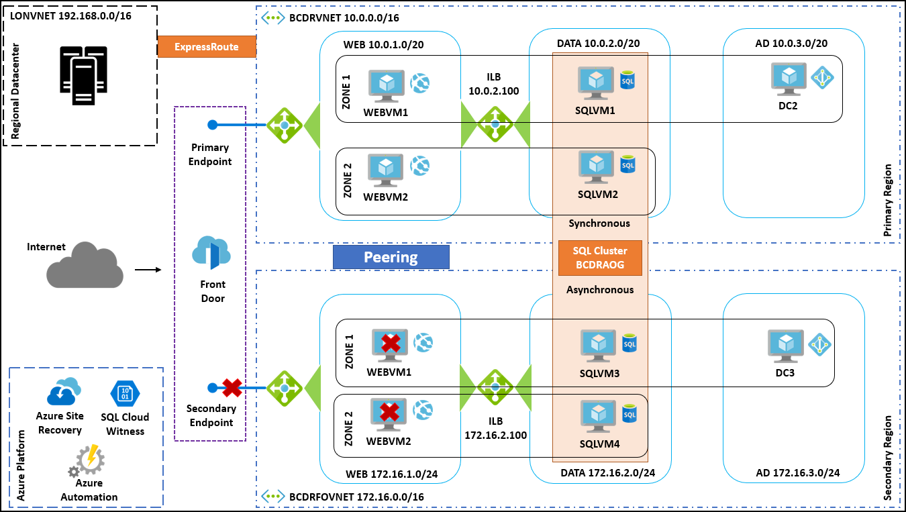

---
lab:
    title: 'Business continuity and disaster recovery - Model Answer'
---

## Preferred solution

*Provide an overview of the technologies and the implementation at a high-level. How will you use Azure's BCDR technologies to meet the Customer's needs?*

1. Azure Regions

   - Which regions should be deployed in support of the goals of the client?

       - North America: East US2, Central US

       - Europe: UK West, UK South

       - Australia: Australia East, Australia Southeast

   - Why did you select these regions?

       - These regions are closest to the locations of their current operations and data centers.

       - Each of these regions is considered "Region Pairs".

       - Miami, London and Sydney all support Express Route, so this will be implemented along with the Premium SKU so all regions can see each other.

2. Backup

   - How can each part of their solution be backed up?

       - IaaS: These deployments will be backed up using an Azure implementation of their third-party backup.

       - PaaS: Azure App Service and SQL Database have built in Backup services that must be implemented. These are robust solutions, but their features are dependent upon the select and SKUs that CI selects during the provisioning of these services.

   - How can they retire and move away from the use of tape archive?

       - The ability to extend their third-party backup solution to use Azure allows it to become an archive target. This means that the customer can move from tapes to the cloud for the final resting place for their backups.

   - Can they continue to use their third-party backup vendor?

       - The majority of the well-known backup vendors have solutions that are available from the Azure Marketplace or are compatible with Azure as a backup archive target. These allow customers to use extend their investment to the cloud and backup VMs that are running in Azure.

3. Disaster Recovery

   - What DR Solutions will be leveraged for the implementation at CI?

       - Azure Site Recovery will be the primary BCDR Servers that is used for DR by CI. The service will be used as a Migration Tool as well as a COB tool for failovers between either on-premises Hyper-V implementations or between two Azure Regions for IaaS deployments.

       - Design a HA and BCDR solution for each of the three application classifications. At a high-level, provide details of your implementation. Make sure to document your design with a diagram along with addressing the questions.

4. Design a HA and BCDR solution for each of the three application classifications. At a high-level provide details of your implementation. Make sure to document your design with a diagram along with addressing the questions.

   - Workgroup Applications

   - What Azure BCDR technologies will you implement for this classification?

       - Given these are single VMs they will be protected locally using Azure Site Recovery to ensure they can be failed over to Azure in case of an outage.

   - How will you migrate these VMs to Azure?

       - The VMs will be migrated to Azure using ASR. This is a one direction failover, and once the VM is up and running and there is verification that all is working properly, the migration will be completed with just one selection in the Azure portal.

       - Once they are migrated to Azure, they will be re-protected to failover to the region pair that is assigned to their area of the world.

   - Can you test the migration before going live?

       - Once the VM is protected, ASR provides the ability to do a test failover to a disconnected Azure virtual network. This meets the requirements of the COB team.

   - Given this will be an IaaS implementation, provide details of how you will provide HA and Failover capabilities to these VMs once they are in Azure.

       - The VM will be implemented using Managed disks and Premium storage. By using Managed disks there is better fault tolerance and with Premium storage the VM will be covered by a 99.9% SLA even for single VM applications.

           

   - Enterprise Applications

   - What Azure BCDR technologies will you implement for this classification?

       - Azure Site Recovery will be leveraged for these applications.

   - Document how you will implement both types of implementations:

       - Migrate to Azure and support Azure Region to Region Failover.

           - The migration to Azure will be completed using a combination of Azure Site Recovery and SQL Always-On Availability Groups. First the AOG will be extended to have Asynchronous replicas running in an Azure Virtual Network over the ExpressRoute Circuit. This allows for an extension of the database to Azure. During the Failover for the migration the Asynchronous side of the AOG will be made a Synchronous replica and then a planned failover will make one of the Azure nodes the primary replica. Once this is completed then ASR will be used to failover the Web tier to Azure. The migration will then be completed using the Azure portal.

           - Once migrated to Azure the application will be re-protected to failover to the region pair that is assigned to their area of the world.

               

       - Remain on-premises for primary, but support Hyper-V to Azure Region Failover

           - Like the migration, the AOG will be extended to have Asynchronous replicas running in an Azure Virtual Network over the ExpressRoute Circuit. This allows for an extension of the database to Azure. Azure Site Recovery will then be configured for a forced failover which will make one of the Asynchronous nodes in Azure a Synchronous replica. Once this is completed then ASR will be used to failover the Web tier to Azure.

           - Once the outage on-premises has been resolved, and the SQL nodes are back online in the local data center a planned failover back using ASR will be executed. This will consist of first resuming data movement on the local nodes running on-premises. Once they are synchronized then a planned failover using ASR will assign a new primary replica locally and fail back the web tier.

               

   - How will SQL Always-On Availability Groups be set up in order to support both of these scenarios?

       - SQL Always-On will have multiple Replicas which are built with Synchronous replication and Automatic failover in the Primary site. The Secondary site will have at least one Asynchronous replication and a Manual failover partner. This will be identical regardless if it is on-premises to Azure or Azure Region to Region.

   - What Azure technology, which is commentary to DR, will you implement to deal with application specific tasks such as Pre-Actions and Post-Actions during a failover?

       - Azure Automation Runbooks will need to be written to support these failovers as they are complex and must be done in the proper sequence. Using Runbooks will allow for single click failovers in both direction and won't involve any manual steps (although they can be built into the plan if the customer desires).

   - Given this will be an IaaS implementation, provide details of how you will provide HA and Failover capabilities to these VMs once they are in Azure.

       - These are mission critical systems that have multiple VMs, so they will be configured to leverage Managed Disks, Availability Zones and Premium disks. This provides for the most fault tolerance available to an Azure VM and will be eligible for a 99.95% SLA. The Internal Load balancer will also be used in front of the SQL Always-On nodes that are running in Azure.

   - How will you direct web traffic to the active site?

       - Azure Front Door will be used for these implementations given that they are a Primary / Secondary failover type of deployment. If the Primary goes down the Monitor Status will show as Degraded and traffic will be sent to the Secondary once it is up and running and shows a Monitor Status of Online.

   - Global, Mobile and API Web Applications

   - What Azure BCDR technologies will you implement for this classification?

       - Given that these are PaaS Services the implementation is much different than IaaS. ASR won't be required to ensure availability of these applications.

   - Given this will be a PaaS implementation, provide details of how you will provide HA and Failover capabilities to these VMs once they are in Azure.

       - Multiple points of presence for these applications will be deployed in the Azure Regions discussed. Given the nature of their business, there will always be at least two POPs per region. The use of Auto scaling will also be leveraged to ensure that the site can deal with traffic spikes.

   - How will SQL Database be set up to support both of these scenarios?

       - The SQL Database will be implemented using Auto Failover Groups. This allows for geo-replication with a single listener name like the SQL Always-On Availability Groups. This dramatically simplifies issues of connection strings within the App Services Application Settings. By pointing at the Listener rather than a server, there should never be an issue if a Database is failed over.

   - What Azure technology and/or DevOps tools will you implement to deal with application specific tasks, such as Pre-Actions and Post-Actions during a failover?

       - Azure Automation could be used again if the application required some type of custom configuration changes during a failure. The Runbooks could be designed to be triggered with a webhook, so that event could fire when there is a failure. Azure DevOps CI/CD tools could be implemented to deal with issues that arise or to perform automated tests based on failovers.

   - How will you direct web traffic to the different POPs around the world?

       - Depending on the application on public endpoints, CI should at a minimum enable Priority routing to failover traffic to secondary locations. Considering Weighted routing to avoid overwhelming a failover target during a failure, and instead distribute the load across multiple endpoints. In situations where the endpoint is expected to be deployed in multiple regions, they should consider Performance method which will route clients to provide the lowest network latency. In some cases, they may need to consider the Geographic method for apps and API's that have data sovereignty considerations and traffic needs to be routed according to the region, country or state/province from which the DNS query of the client originates.

## Checklist of preferred objection handling

1. With the move to the cloud, they are uncomfortable with any situation that assumes the cloud provider will handle their fail-over.

    Using ASR CI will be able to handle all of their own DR. They will be using familiar tools with the Azure Portal and Hyper-V.

2. They have many systems that need to be accounted for, and they aren't sure if the tools really exist to give them the business continuity they desire.

    There are BCDR tools built into the all of the different application classification they have at CI, including Linux.

3. They want to know their BCDR solution is secure.

    All of the traffic and data used for all Azure BCDR features is secured both at rest and in-transit. As a result, there is no difference in this data and any other data that is running or stored in Azure.

4. They have heavily invested in a third-party backup solution but want to use Azure as their archive. Does Azure support this?

    Azure has support for third-party backup providers through the Azure Marketplace. It's possible to both backup VMs using these tools by deploying them to Azure IaaS or by extending the backup infrastructure to use the Azure cloud as an archive target.

## Customer quote (to be read back to the attendees at the end)

"Azure has BCDR built into each classification of application that we have here at Contoso Insurance. This depth and breadth will allow us to meet both our business needs and regulatory requirements for our applications. Not to mention ensuring our agents are able to help our customers in their time of need."

- Liz Simmons, VP of data centers