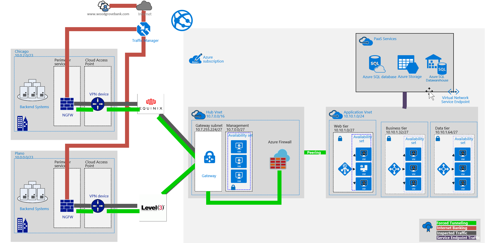
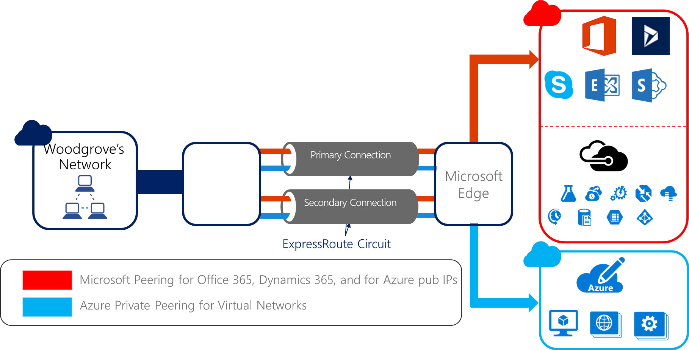
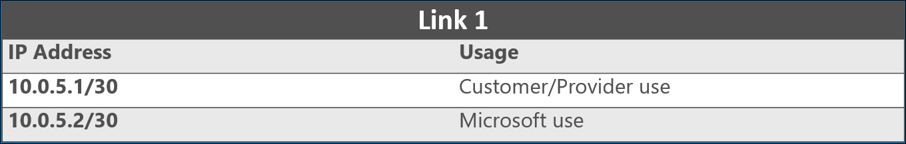
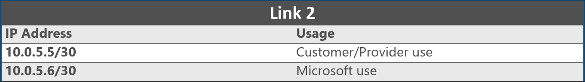
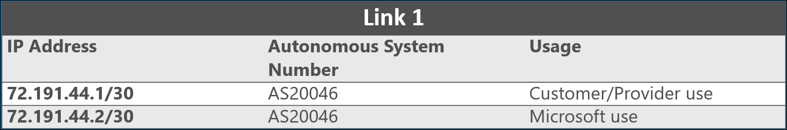

---
lab:
    title: 'Enterprise-class networking in Azure - Model Answer'
---

# Enterprise-class networking in Azure - Model Answer

## Preferred solution

*High-level architecture*

1. Create a high-level architecture diagram and explanation of the components of your solution.

The solution for Woodgrove involved several technologies, including:

-   ExpressRoute with private and Microsoft peering enabled for connectivity for its virtual machines/Virtual Networks, and potential future plans for accessing Microsoft public services.

-   Advanced networking, which allows certain instance sizes to hit 25 Gbps for accelerated networking scenarios.

-   Testing the resiliency of the networking design. which involves taking a link down and ensuring services are still available.

-   Just-in-time (JIT) access for secure remote administration to a Jump box in Azure (this Jump box could be deallocated to reduce costs until required).

-   Implementing an enterprise-class configuration within an Azure Virtual Network to support the 3-tier core banking application. Components of this solution include:

    -   Multiple Virtual Networks

    -   Six subnet designations, including gateway, perimeter, web tier, business tier, data tier, and management subnet.

    -   Azure Firewall configured to provide hybrid connectivity support and internal firewall capabilities internal to the Azure VNet and any paired VNets.

    -   Five route tables associated with their corresponding subnets, each with specific user defined routes configured.

    -   Five Network Security Groups associated with their respective subnets, each with specific allow/deny rules configured.

    -   Application Security Groups (three per each multi-tier legacy business app) to secure traffic within the same subnet, along with the corresponding Network Security Groups.

    -   Three internal Azure Load Balancers to direct load to the primary NGFW and to the servers in each application tier.

    -   One application gateway to load balance incoming traffic and provide Layer-7 (WAG and WAF) protection of the Web tier.

    -   Virtual Network Service endpoints to further secure access to PaaS services such as storage and Azure SQL.

-   Implementing a WAF in order to inspect and protect incoming traffic.

      -   Application Gateway will be used.

      -   Azure Web Apps will be configured as back-end pool members of Application Gateway.

    -   To ensure that incoming traffic is directed via the Application Gateway, a CNAME record can be used to designate the public endpoint of the application gateway.

      -   To create the CNAME record, it is necessary to create a public IP address resource and assign to it a DNS name.

-   Implementing DDoS protection services for the virtual networks hosting Data and Web tiers in order to protect them against DDoS attacks.
  
-   Implementing Azure Firewall to make sure it protects and filters all the traffic coming into and going out from the Azure virtual network.


    


*Address the following customer requirements*


1. Explain the approach you would take to deploying ExpressRoute Circuits including location and circuit size.*

    Two ExpressRoute circuits will be provisioned.

    -   The first will be connected in Dallas, TX (corresponding to the Plano, TX Woodgrove datacenter) and will take advantage of level 3 Communications as the connectivity provider.

    -   The second will be connected in Chicago, IL (corresponding to Woodgrove's Chicago, IL datacenter) and will take advantage of Equinix as the connectivity provider.

    Taking advantage of different providers will enable Woodgrove to maintain robust connectivity to Azure even in the case of a catastrophic provider issue.

    Because of the potential of large amounts of data movement back and forth between Azure and the on-premises environment, the metered data option was chosen for both ExpressRoute circuits (customer has the option of converting from metered to unlimited if needed). From a bandwidth perspective, after completing a study of current bandwidth usage trends, 1 Gbps circuit sizes were selected for both ExpressRoute circuits.


2. What ExpressRoute peering options you would enable and what workloads would use them? Diagram your peering configuration including subnet, IP and autonomous system number configuration needed.

    After learning that, with ExpressRoute, PaaS services do not traverse the internet, there was renewed interest in planning for PaaS adoption. These needs, in conjunction with connecting to private services (such as IaaS), dictate for the ExpressRoute circuits to be set up for private and Microsoft peering.

    

    Figure 2 - Peering for ExpressRoute

    **Private peering**

    To support private peering, Woodgrove needed to provide addresses from a range that does not overlap with internal networks or Azure-based Virtual Networks. The addresses can be public or private. They need to provide either a single /29 or two /30 subnets (a /29 will be broken up into 2 /30 subnets). Woodgrove chose to use:

    -   10.0.5.0/30

    -   10.0.5.4/30

    Addresses from the two subnets will be used to establish two private peering for redundancy.

    

    

    **Microsoft peering**

    Woodgrove needed to provide public IP addresses they own to set up Microsoft peering. Microsoft must be able to verify the ownership of the IP addresses through Routing Internet Registries and Internet Routing Registries. Additionally, Woodgrove must use their registered Autonomous System (AS) number in the peering configuration. Woodgrove's registered AS number is AS20046. They chose to use the following from their public IP addresses:

    -   72.191.44.0/30

    -   72.191.44.4/30

    

    

    **ExpressRoute connectivity type for Chicago**

    Woodgrove Financial Services happen to use co-location datacenter space at a facility in which Equinix has a presence. As a result, it made sense to connect the ExpressRoute circuit in Chicago using virtual cross-connections through Equinix's Ethernet exchange. To reduce cost, Woodgrove chose Equinix's unmanaged layer 2 connectivity. It requires Woodgrove networking staff to provision redundant edge routers and to configure all BGP peering. Specifically, they will need to:

    -   Create an ExpressRoute circuit by using the following command:

    ```
        New-AzureRmExpressRouteCircuit -Name <<circuit-name>> -ResourceGroupName <<resource-group>> -Location <<location>> -SkuTier <<sku-tier>> `

    > -SkuFamily <<sku-family>> -ServiceProviderName <<service-provider-name>> -PeeringLocation <<peering-location>> -BandwidthInMbps <<bandwidth-in-mbps>>
    ```

    -   Send the ServiceKey for the new circuit to the service provider.

    -   Wait for the provider to provision the circuit. You can verify the provisioning state of a circuit by using the following PowerShell command:

    ```
    Get-AzureRmExpressRouteCircuit -Name <<circuit-name>> -ResourceGroupName <<resource-group>>
    ```

    -   Reserve two /30 subnets for each peering type desired (private or public for private peering and public for Microsoft peering). These /30 subnets will be used to provide IP addresses for the routers used for the circuit.

    -   Configure routing for the ExpressRoute circuit. You need to run the command below for each type of peering you want to configure (private and Microsoft).

    ```
    Set-AzureRmExpressRouteCircuitPeeringConfig -Name <<peering-name -Circuit <<circuit-name -PeeringType <<peering-type -PeerASN <<peer-asn -PrimaryPeerAddressPrefix <<primary-peer-address-prefix -SecondaryPeerAddressPrefix <<secondary-peer-address-prefix -VlanId <<vlan-id

    Set-AzureRmExpressRouteCircuit -ExpressRouteCircuit <<circuit-name>>
    ```

    -   Reserve another pool of valid Public IP addresses to use for NAT for Microsoft peering. Specify the pool to your connectivity provider, so they can configure BGP advertisements for those ranges.

    -   Link your private VNet(s) in the cloud to the ExpressRoute circuit. Use the following PowerShell commands:

    ```
    $circuit = Get-AzureRmExpressRouteCircuit -Name <<circuit-name -ResourceGroupName <<resource-group

    $gw = Get-AzureRmVirtualNetworkGateway -Name <<gateway-name -ResourceGroupName <<resource-group>>

    New-AzureRmVirtualNetworkGatewayConnection -Name <<connection-name -ResourceGroupName <<resource-group -Location <<location>> -VirtualNetworkGateway1 $gw -PeerId $circuit.Id -ConnectionType ExpressRoute
    ```

    Because Woodgrove is using a layer 2 connection in Chicago, they deployed redundant routers in the datacenter in an active-active configuration. They connected the primary connection to one router and the secondary connection to the other. It provided a highly available connectivity at both ends of the connection. It is necessary to realize the ExpressRoute SLA.

    **ExpressRoute connectivity type for Plano**

    At the Plano datacenter, Woodgrove opted to work with level 3 and connect the second ExpressRoute circuit to their existing MPLS cloud. This connectivity type was offered as a managed layer 3 service, which Woodgrove signed up for. The steps to configure ExpressRoute in this case are fewer because the provider configures BGP peering on the customer's behalf. The steps to complete are:

    -   Create an ExpressRoute circuit by using the following command:

    ```
    New-AzureRmExpressRouteCircuit -Name <<circuit-name -ResourceGroupName <<resource-group -Location <<location -SkuTier <<sku-tier `
    -SkuFamily <<sku-family -ServiceProviderName <<service-provider-name -PeeringLocation <<peering-location -BandwidthInMbps <<bandwidth-in-mbps>>
    ```

    -   Send the ServiceKey for the new circuit to the service provider.

    -   Wait for the provider to provision the circuit. You can verify the provisioning state of a circuit by using the following PowerShell command:

    ```
    Get-AzureRmExpressRouteCircuit -Name <<circuit-name -ResourceGroupName <<resource-group>>
    ```

    -   Link your private VNet(s) in the cloud to the ExpressRoute circuit. Use the following PowerShell commands:

    ```
    $circuit = Get-AzureRmExpressRouteCircuit -Name <<circuit-name>> -ResourceGroupName <<resource-group>>

    $gw = Get-AzureRmVirtualNetworkGateway -Name <<gateway-name>> -ResourceGroupName <<resource-group>>

    New-AzureRmVirtualNetworkGatewayConnection -Name <<connection-name>> -ResourceGroupName <<resource-group>> -Location <<location> -VirtualNetworkGateway1 $gw -PeerId $circuit.Id -ConnectionType ExpressRoute
    ```

3. What are the NAT requirements for ExpressRoute integration?

    The Microsoft peering path enables you to connect to all services hosted in Azure over their Public IP addresses. These services include all services listed in the ExpressRoute FAQ and any services hosted by ISVs on Microsoft Azure. The Microsoft peering also lets you connect to Office 365 services such as Exchange Online, SharePoint Online, Skype for Business, and to CRM Online. Microsoft supports bidirectional connectivity via Microsoft peering. Traffic destined to Microsoft cloud services must be SNATed to valid Public IPv4 or IPv6 addresses before they enter the Microsoft network.

    

    Figure : Microsoft peering SNAT

4. How does your design address availability at the network layer?

    The following diagram shows a configuration with redundant on-premises routers connected to the primary and secondary circuits. Each circuit handles the traffic for a Microsoft peering and a private peering.

    

    Figure 4 - Redundancy and Peering with ExpressRoute

    Azure Firewall has high-availability built-in, so no additional load balancers are required and there is nothing for you to configure for redundancy.


5. How is routing configured in your overall design?

    For many cases, this solution will apply user defined routes to ensure desired routing; however, because ExpressRoute is in use, we must take advantage of BGP routing for some scenarios like force tunneling. In the case of the preferred solution, we are using a BGP route to force outbound internet traffic back to an on-premises firewall. This device is monitoring outbound traffic for sensitive data such as unencrypted social security numbers, credit card numbers, etc.

    Keep in mind that user defined routing only applies to traffic leaving the subnet they are applied to. Also, the appliance you are forwarding traffic to cannot be in the same subnet where the traffic originates. Always create a separate subnet for your appliances.

    **Web tier subnet route table**

    **Address Prefix**               |  **Next Hop Type** |   **Next Hop Address**
    --------------------------------- | ------------------- | ----------------------
    0.0.0.0/0                         | Virtual Appliance  |  10.7.0.38
    10.10.1.32/27 (Business Tier)    |  Virtual Appliance  |  10.7.0.38
    10.10.1.64/27 (Data Tier)        |  Virtual Appliance  |  10.7.0.38
    10.7.255.224/27 (GatewaySubnet)  |  Virtual Appliance  |  10.7.0.38
    10.7.0.0/27 (MGMT Subnet)        |  Virtual Appliance  |  10.7.0.38

    **Business tier subnet route table**

    **Address Prefix**               |  **Next Hop Type** |   **Next Hop Address**
    --------------------------------- |  ------------------- | ----------------------
    0.0.0.0/0                        |  Virtual Appliance  |  10.7.0.38
    10.10.1.64/27 (Data Tier)        |  Virtual Appliance  |  10.7.0.38
    10.10.1.0/27 (Web Tier)          |  Virtual Appliance  |  10.7.0.38
    10.7.255.224/27 (GatewaySubnet)  |  Virtual Appliance  |  10.7.0.38
    10.7.0.0/27 (MGMT Subnet)        |  Virtual Appliance  |  10.7.0.38

    **Data tier subnet route table**

    **Address Prefix**               |  **Next Hop Type**  |  **Next Hop Address**
    --------------------------------- |  ------------------- | ----------------------
    0.0.0.0/0                       |   Virtual Appliance |   10.7.0.38
    10.10.1.32/27 (Business Tier)   |   Virtual Appliance |   10.7.0.38
    10.10.1.0/27 (Web Tier)         |   Virtual Appliance |   10.7.0.38
    10.7.255.224/27 (GatewaySubnet) |   Virtual Appliance |   10.7.0.38
    10.7.0.0/27 (MGMT Subnet)       |   Virtual Appliance |   10.7.0.38

6. Identify where Network Security Groups are used in your design.

    Network Security Groups (NSGs) will be used to help secure the configuration by limiting traffic flow. NSGs function by customer-defined inbound and outbound filter rules. NSGs may be applied to either individual NICs or to subnets. In Woodgrove's case, there will be a single NSG applied to each subnet.

    **Perimeter NSG**

    Traffic to manage the NSGs will only be allowed from the management subnet and from within the headquarters address range that represents the Woodgrove Financial Services NOC.

    **Name**  |   **Priority** |   **Source**              |     **Protocol** |   **Source Port Range** |  **Destination**  |  **Dest. Port Range** |   **Action**
    ----------- | -------------- | --------------------------- | -------------- |  ----------------------- | ----------------- |  ---------------------- | ------------
    MGMT1       | 100            | 10.7.0.0/27                 | TCP            | Any                     | 10.7.0.32/27      | 807                    | Allow
    MGMT2       | 110            | 10.7.0.0/27                 | TCP            | Any                     | 10.7.0.32/27      | 801                    | Allow
    TINA\_VPN   | 200            | OnPrem PIP of VPN gateway   | Any            | Any                     | 10.7.0.32/27      | 691                    | Allow
    HTTP        | 300            | Any                         | TCP            | Any                     | 10.7.0.32/27      | 80                     | Allow
    SSH         | 400            | 10.7.0.0/27                 | TCP            | Any                     | 10.7.0.32/27      | 22                     | Allow
    MGMT3       | 500            | 10.7.0.0/27                 | TCP            | Any                     | 10.7.0.32/27      | 807                    | Allow
    MGMT4       | 510            | 10.7.0.0/27                 | TCP            | Any                     | 10.7.0.32/27      | 801                    | Allow
    MGMT4       | 520            | 10.7.0.0/27                 | TCP            | Any                     | 10.7.0.32/27      | 22                     | Allow

    **Management NSG**

    Only RDP traffic from the headquarters-based NOC will be allowed into the management subnet.

    **Name**  |  **Priority**  |  **Source**   |  **Protocol**  |  **Source Port Range**  |  **Destination**  |  **Dest. Port Range**  |  **Action**
    ---------- | --------------|  ------------- | --------------|  ----------------------- | ----------------- | ---------------------- | ------------
    RDP        | 100           |  10.0.2.0/23 |   Any           |  Any                    |  10.7.0.0/27      |  3389                  | Allow
    RDP       |  110           |  10.0.0.0/23  |  Any            | Any                    |  10.7.0.0/27      |  3389                  |  Allow

    **Web Tier NSG**

    **Name**  |  **Priority**  |  **Source**  |   **Protocol** |   **Source Port Range** |   **Destination**  |  **Dest. Port Range** |  **Action**
    ----------|  --------------|  -------------|  --------------|  ----------------------- | ----------------- | ----------------------|  ------------
    HTTP      |  100           |  Any           | TCP            | Any                     | 10.10.1.0/27      | 80                    |  Allow
    HTTPS     |  110           |  Any           | TCP           |  Any                     | 10.10.1.0/27      | 443                   |  Allow
    RDP       |  120           |  10.7.0.0/27  |  Any          |   Any                    |  10.10.1.0/27     |  3389                  |  Allow

    **Business Tier NSG**

    **Name**  |  **Priority** |   **Source**  |    **Protocol** |   **Source Port Range** |   **Destination** |   **Dest. Port Range** |   **Action**
    ---------- | -------------- | -------------- | -------------- | -----------------------| ----------------- | ---------------------- | ------------
    RDP        | 100           |  10.7.0.0/27   |  Any           |  Any                     | 10.10.1.32/27    |  3389                  |  Allow
    HTTPS     |  110           |  10.10.1.0/27  |  TCP           |  Any                    |  10.10.1.32/27   |   443                   |  Allow

    **Data Tier NSG**

    **Name** |   **Priority**  |  **Source**   |    **Protocol**  |  **Source Port Range** |   **Destination** |  **Dest. Port Range**  |  **Action**
    ---------- | --------------|  --------------- | -------------- | ----------------------- | ----------------- | ---------------------- | ------------
    SQL        | 100           |  10.10.1.32/27  |  TCP           |  Any                     | 10.10.1.64/27    |  1433                  |  Allow
    RDP        | 110           |  10.7.0.0/27    |  ANY           |  Any                    |  10.10.1.64/27     | 3389                  |  Allow


    In addition, to accommodate control of traffic flow for legacy business apps that will be collocated on the same subnets, the design includes provisions for creating Application Security Groups. There will be a distinct application security group per application (e.g. App1WebTier, App1BusinessTier, and App1DataTier), with the corresponding Network Security Groups, referencing individual application security groups as their sources or destinations. 

## Checklist of preferred objection handling

1.  As a financial institution, Woodgrove is under tight regulatory compliance requirements. Security is a key aspect of compliance and as such, it must be a key tenant of all operations including those related to technology. The corporate security officer is generally opposed to using services solely accessible over the public internet. Services like Office 365, CRM, and other Microsoft SaaS offerings are off limits. Additionally, PaaS services accessed over the internet are also unusable. It has relegated Woodgrove to private Azure services such as IaaS.

    **Potential Answer**
    
    Using ExpressRoute, Woodgrove can access and use Azure private and public services without traversing the internet. This secure connectivity, in addition to the business-class SLAs and greater bandwidth, make ExpressRoute a compelling offering that addresses this objection. Regarding SaaS offerings, such as Office 365, Woodgrove can employ Azure Active Directory conditional access to provide controls such as a multi-factor authenticated user, an authenticated device, and a compliant device. All traffic to and from Office 365 is encrypted with SSL/TLS, and the data is encrypted at rest in Microsoft datacenters.

2.  The director of Network Operations is under the impression that complex enterprise-grade networking scenarios, such as those that support n-tier applications, cannot be configured in hyper-scale public clouds. Trust comes slowly with this director. She will most likely need detailed solution plans, case studies, and even customer testimonials to help convince her of the viability of anything other than simple networking scenarios in Azure.

    **Potential Answer**
    
    Azure supports many critical enterprise-grade scenarios, including scenarios that require hybrid connectivity and high availability such as Woodgrove. Many of these scenarios are documented in the Azure Architecture Center with reference architectures that cover best practices. 

3. The director of Network Operations also does not trust cloud security. She will need a strategy in place which allows Network Engineers the ability to analyze traffic flows and capture packets when needed for cloud-hosted resources.

    **Potential Answer**
    
    Azure fully supports forced tunneling ensuring that all internet traffic is directed to the desired site, be that in an Azure Virtual Network or on-premises. For example, all Internet traffic can easily be routed from Azure to an on-premises appliance for intrusion detection/prevention and logging.

4. The corporate compliance officer of Woodgrove must ensure compliance with many requirements to ensure his organization passes audits from both internal and external entities. One requirement is all outbound internet requests must pass through an on-premises system that inspects and logs this traffic. The CCO is skeptical of IaaS solutions in Azure since "those VMs in the cloud can access the internet directly."

    **Potential Answer**
    
    This can be addressed by enabling forced tunneling, which directs all outbound traffic to an on-premises location such as a security appliance. This is enabled in ExpressRoute by advertising a default BGP route.


## Customer quote (to be read back to the attendees at the end)

Quote from the Network Director:

"Azure's advanced networking capabilities and support for partner solutions are a welcome surprise. Your proof of concept has clearly demonstrated the platform's ability to more than satisfy our complex requirements."

