---
lab:
    title: 'Enterprise-ready cloud - Model Answer'
---

# Enterprise-ready cloud - Model Answer

## Preferred solution

*Cost Management*

1. **Design:** What tools are available to meet the cost management requirements of the individual business units, the finance team, and the Cloud Governance team? These requirements include setting budgets and alerts for each cost center, creating spending reports and forecasts, and identifying and investigating anomalies. What permissions and configuration are required to enable users to have access to these tools?

    **Solution:** Azure currently offers two services for cost management. There is a cost management feature integrated into the Azure portal. In addition, EA subscriptions also offer the ability to roll up billing at an account, department or EA level.

    Regardless of which cost management tool is used, the first step is to ensure all Azure subscriptions are organized into an appropriate hierarchy. Costs can then be aggregated at each node in this hierarchy for roll-up reporting. Each of the three tools described uses a separate hierarchy:
    - Cost management in the Azure portal uses the management group hierarchy.
    - EA subscriptions are organized into a 4-level hierarchy, comprising the EA (root), departments, accounts, and subscriptions.

    Where multiple cost management tools are used, it will make most sense to mirror the same hierarchy across each tool. We will focus on the management group hierarchy, since this hierarchy is also fundamental to many of the other governance controls Trey will use.

    For Trey Research, the hierarchy will comprise the tenant root management group, followed by a separate management group for each business unit (Electronics, Life Sciences, etc.). Under each of these management groups sits another management group for each subunit (Product Development, Marketing, Sales & Support). An additional management group layer is used for the regional subunits within Sales and Support.

    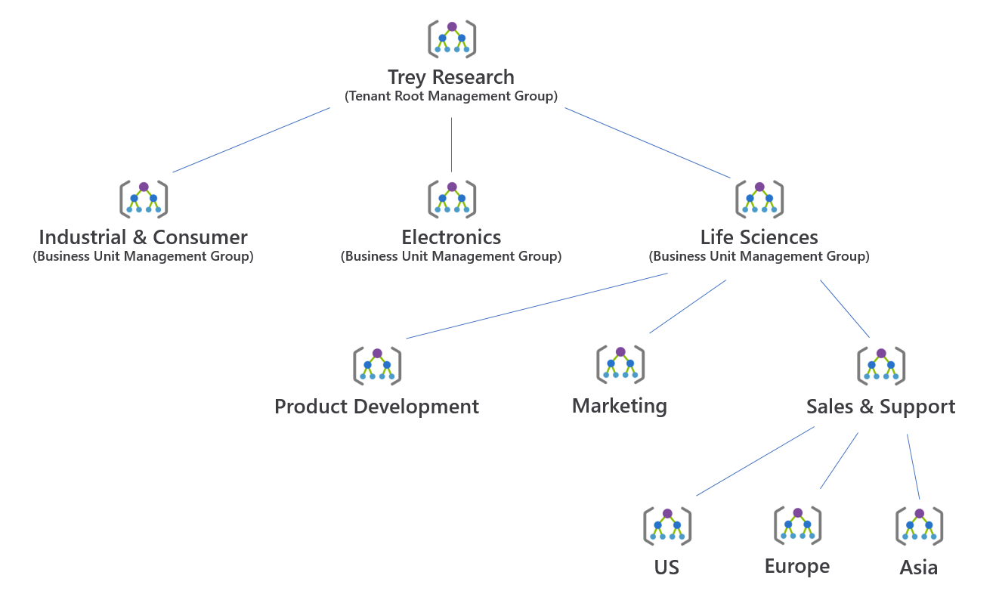

    Under each of these management groups, subscriptions used by each subunit are created, and applications deployed within each subscription. This can be organized in several ways. It is a good idea to group production deployments together, at either the subscription level or by including an additional management group level. Likewise, pre-production deployments and Dev/Test deployments should also be grouped.

    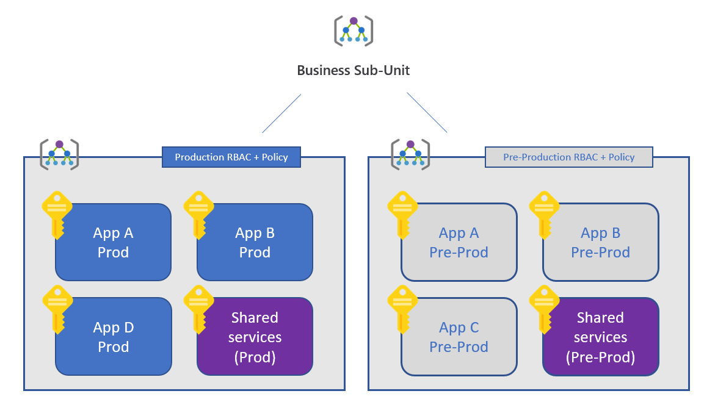

    With the subscription hierarchy in place, Trey can now implement cost management.

    *Cost Management in the Azure Portal*

    For most requirements, Trey can use the Azure cost management features that are integrated into the Azure portal. This is available under **All Services > Cost Management + Billing**. This provides:

    - Cost analysis reports. These allow you to analyze your Azure spend (<https://docs.microsoft.com/en-us/azure/cost-management/quick-acm-cost-analysis#review-costs-in-cost-analysis>). After first defining your date range, you can then view charts of either daily, monthly, or cumulative spend. These charts can be filtered or segmented based on a wide range of criteria, such as resource group, resource type, location, or based on resource tags. This variety of charts and ability to drill down into the data is useful for investigating spending anomalies.

    
  
    - Budgets and Alerts. You can define a budget and configure alerts when a percentage of that budget is spent (<https://docs.microsoft.com/azure/cost-management/tutorial-acm-create-budgets>). Alerts are integrated with action groups, enabling a variety of alert actions (such as email, SMS, or even triggering custom automation).

    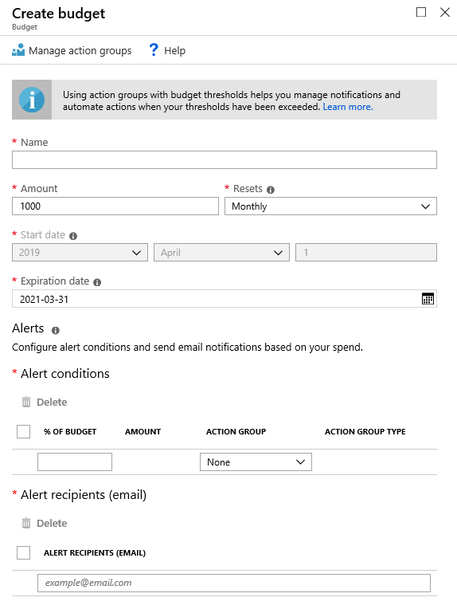

    Cost analysis, budgets and alerts can be defined at a variety of scopes, from management groups to subscriptions to individual resource groups (see the cost management features on the respective management group, subscription and resource group blades). Information from cost analysis can also be downloaded through a detailed .csv with any filters or groupings applied to the exported data.

    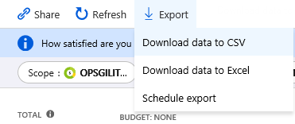

    > **Note:** Users must be assigned the Cost Management Reader role at the appropriate scope to have access to cost analysis reports. These permissions are also included in the Reader, Contributor and Owner roles.
    >
    > For EA subscriptions, an Enrollment Administrator must enable "AO view charges" in the Azure EA Portal ([https://ea.azure.com](https://ea.azure.com)) to enable cost views in Azure Cost Management.
    >
    > 
    >
    > For further details, see <https://docs.microsoft.com/azure/cost-management/assign-access-acm-data>.

2. **Design:** Design a charge back mechanism for the business units for resources they consume based on the IO code for each application. Assuming your design is based on resource-level tags, how will you implement the following use cases?

    - Every resource group must have an 'IOCode' tag
    - Every time a resource is created, it is assigned an 'IOCode' tag with a value matching its resource group
    - Any resource whose 'IOCode' tag is missing or does not match its corresponding resource group tag (for example, after moving the resource between resource groups) can be easily identified. Child resources, for which tags to not apply, are excluded.

    **Solution:** The IOCode tag will be implemented using three separate Azure policy definitions.

    The first policy requires that all resource groups are assigned the 'IOCode' tag. The built-in policy **Require specified tag on resource groups** can be used. Note that this policy uses '"mode": "all"', since the alternative '"mode": "indexed"' does not apply to resource groups. The policy rule is specific to resource groups only.

    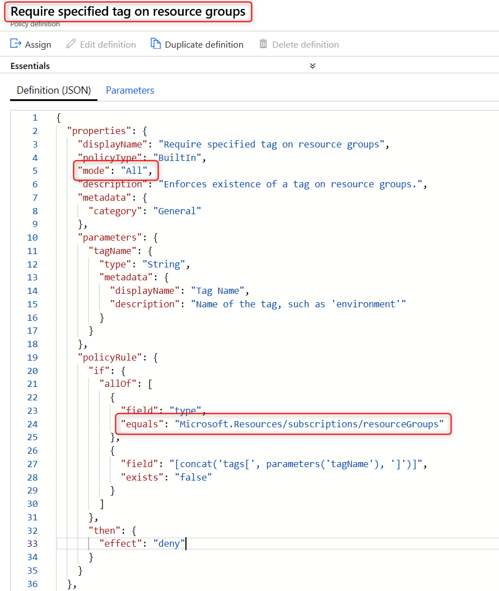

    > **Note:** This policy will require that all resource groups specify the IOCode tag *at the time they are created*. Using the Azure portal, it will no longer be possible to create a resource group at the same time as deploying a resource. You will need to create the resource group separately so the resource group tag can be specified.

    The second policy requires that each resource is assigned an 'IOCode' tag upon creation. If the 'IOCode' tag is missing, then it is added automatically, using the value from the corresponding resource group tag.  The built-in policy **Append tag and its value from the resource group** can be used. Note that this policy uses '"mode": "indexed"', which ensures this policy only applies to resources which can be tagged, and not to child resources which do not support tags (such as subnets of a virtual network).

    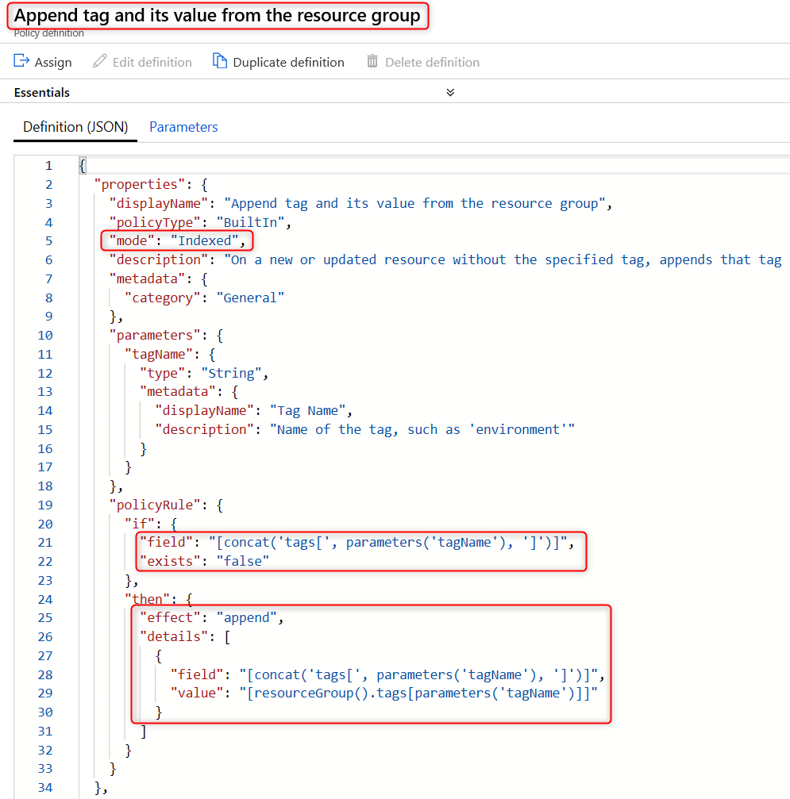

    The above policy does not enforce that the IOCode tag, if present when the resource is created, matches the IOCode tag of the resource group. This case will be audited by our third policy. However, this policy could be used a basis for a custom policy which does enforce that the IOCodes on the resource and resource group match.

    The third policy audits that the IOCode tag is present on all resources, and that its value matches the value of the corresponding resource group tag. As with the previous rule, '"mode": "indexed"' is used to avoid creating false audit reports for child resource types. In this case, a custom definition is required:

    ```json
    {
        "mode": "Indexed",
        "parameters": {
            "tagName": {
                "type": "String",
                "metadata": {
                    "displayName": "Tag Name",
                    "description": "Name of the tag, such as 'environment'"
                }
            }
        },
        "policyRule": {
            "if": {
                "not": {
                    "field": "[concat('tags[', parameters('tagName'), ']')]",
                    "equals": "[resourceGroup().tags[parameters('tagName')]]"
                }
            },
            "then": {
                "effect": "audit"
            }
        }
    }
    ```

    These three policy definitions are grouped into a single policy initiative, for ease of management. A single initiative parameter, 'Tag Name', is passed to all three policy definitions.

    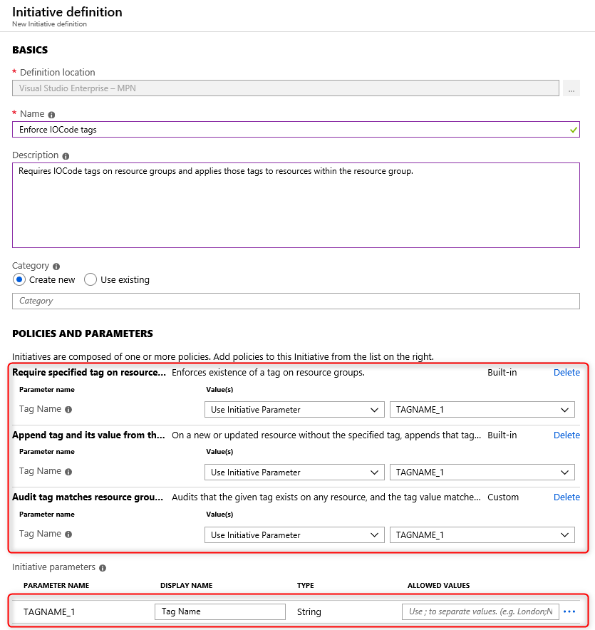

    This initiative will then be assigned at an appropriate management group scope (perhaps even the tenant root management group) so the policies are effective across all subscriptions in the organization.
  
3. **Design:** Design a cost allocation mechanism to track Azure costs across the Development and Test, Production, Support Services, and Infrastructure categories.

    **Solution:** To enforce a taxonomy that would group resource costs by the following categories, each new subscription would need an ARM policy assigned that enforced resource groups to have a tag with one of the following values assigned:

    - Tag Name: Environment---Value: Development and Test
    - Tag Name: Environment---Value: Production
    - Tag Name: Environment---Value: Support Services
    - Tag Name: Environment---Value: Infrastructure

    This can be done with built in policies, specifically by applying the **Apply tag and its default value** and the **Enforce tag and its value** policies. A new resource group would be created for each environment (Production, Dev, etc.) and these policies would be applied, specifying the tags to assign.

    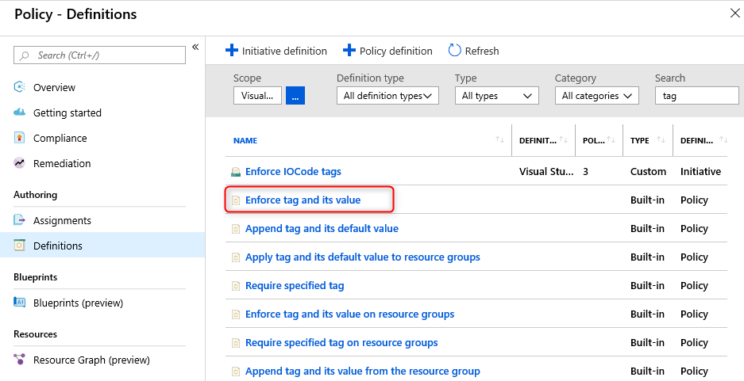

    Once resources are tagged, costs can be tracked using the cost management tools described earlier.

*Security Baseline* <!-- omit in toc -->

1. **Design:** Following an outage, how can you identify and analyze any recent changes which may have contributed? Investigations will require details of which resource was changed, when it was changed, who made the change, and what was changed. How can you track changes to both resource properties (capturing both before and after state) as well as changes inside a virtual machine?

    **Solution:** The Azure activity log provides a full history of changes to the configuration of Azure resources. It shows when changes were made, and which account made the changes. The log can be filtered in many ways (resource type, resource group, time, event severity, etc.) and exported as a CSV for processing off-line.

    

    Below is an example of the Azure Activity Log providing details of exactly which resource properties were changed. Details are displayed for the properties of the resource either before or after the values have been changed due to configuration updates or regular deployments through automation for example. This data is available from the change history feature of the Azure resource graph (currently in public preview).

    

    To view the change history for a resource in the Azure portal, identify and select the resource in the **Activity Log**. Then select the **Change History (preview)** tab.

    This tab shows a list of timestamps for each change. Select a timestamp to see a visual diff of the change.

    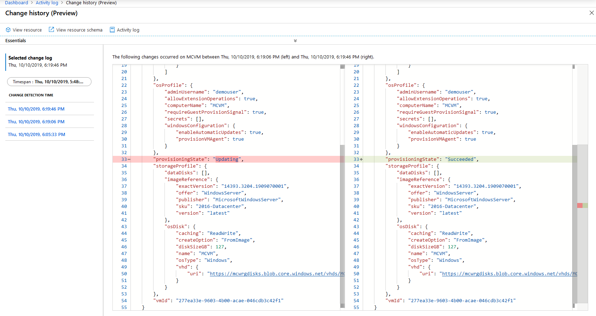

    For more information on the resource graph change history, see <https://docs.microsoft.com/azure/governance/resource-graph/how-to/get-resource-changes> and <https://docs.microsoft.com/azure/governance/policy/how-to/determine-non-compliance#change-history-preview>.

    The change history only captures changes to resource properties. It does not capture changes that occur within an Azure VM. To monitor VM changes, the Azure Automation Change Tracking solution should be used. Supporting both Windows and Linux, this solution tracks VM changes including files, registry keys, services/daemons, and software deployments. For more information, see <https://docs.microsoft.com/azure/automation/automation-change-tracking>.

    Azure Services such as Network Watcher can be implemented to ensure that traffic from non-malicious sources are flowing in and out of the network along the routes intended for service and access. Deeper telemetry can be gathered when combined with the Log Analytics Service which can be used to collect and query Network Performance. The detection of network issues like traffic black holing and routing errors are easily detected as well as outages which will inform the Security team before the users do.

    

    Deeper telemetry can be gathered when combined with the Log Analytics Service which can be used to collect and query Network Performance. Features within Log Analytics like the NSG flow log capability which allows you to log the source and destination IP address, port, protocol, and whether traffic was allowed or denied by an NSG. You can analyze logs using a variety of tools, such as PowerBI and the traffic analytics capability

    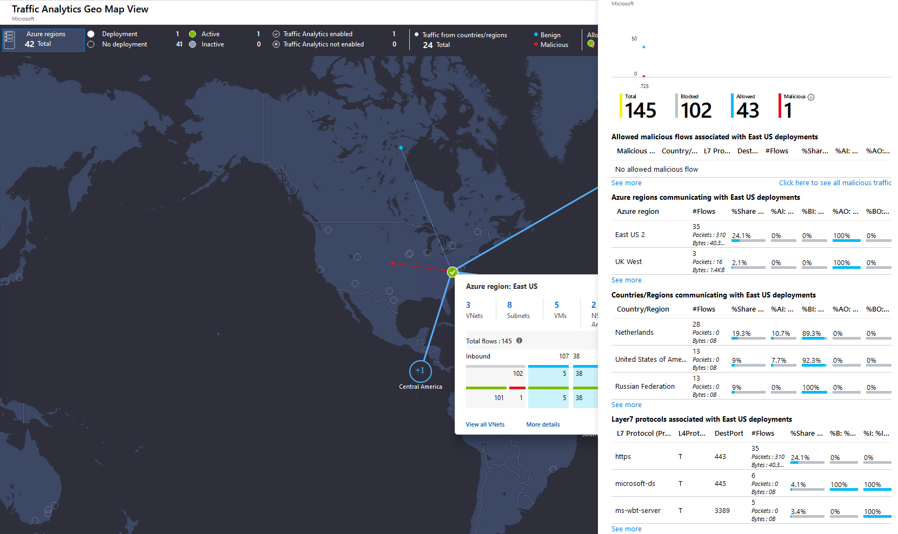

    Creating a centralized network for all business units to flow throw will help with visibility. This approach allows for streamlining security enabling Trey Research to proactively monitor all network activity in real-time and respond to threats or misuse before they become an issue. It helps to eliminate bandwidth-intensive activities by ensuring web usage is safe and suitable improving network performance. It allows a more centralized approach to creating, editing and enforcing corporate security policies. This can easily be managed by utilizing the Initiative feature within the Azure Policy service which allows you to group policies that are tailored towards achieving a singular goal.

    

2. **Design:** How can you ensure that both Windows and Linux VMs meet password complexity requirements?

    **Solution:** Azure policy guest configuration allows Azure policy to be used to audit settings with an Azure VM (Windows and Linux). It can be used to audit and deploy application settings and installed software. It can also be used to enforce password age and complexity rules. A variety of built-in policy definitions are available. The built-in policy initiative **\[Preview\]: Audit VMs with insecure password security settings** contains a default collection of password policy definitions for both Windows and Linux VMs.

    ![Screenshot showing the policy definitions in the '\[Preview\]: Audit VMs with insecure password security settings' policy initiative](images/password-policy.png "Password policy for guest VMs")

3. **Design:** How can you ensure that only approved OS images are used when creating new VMs? Your implementation should support a customizable list of built-in images as well as custom images.

    **Solution:** Azure policy can be used to control which OS images may be used with any Azure VM. Both built-in and custom images can be supported. The built-in policy **\[Preview\]: Audit Log Analytics Agent Deployment - VM Image (OS) unlisted** provides an example that can be used as a baseline for a custom policy.

    ```json
    {
        "parameters": {
            "CustomImageIds": {
                "type": "Array",
                "metadata": {
                    "displayName": "Optional: List of VM images to allow",
                    "description": "Example value: '/subscriptions/<subscriptionId>/resourceGroups/YourResourceGroup/providers/Microsoft.Compute/images/ContosoStdImage'"
                },
                "defaultValue": []
            }
        },
        "policyRule": {
            "if": {
                "allOf": [
                    {
                        "field": "type",
                        "equals": "Microsoft.Compute/virtualMachines"
                    },
                    {
                        "not": {
                            "anyOf": [
                                {
                                    "field": "Microsoft.Compute/imageId",
                                    "in": "[parameters('CustomImageIds')]"
                                },
                                {
                                    "allOf": [
                                        {
                                            "field": "Microsoft.Compute/imagePublisher",
                                            "equals": "MicrosoftWindowsServer"
                                        },
                                        {
                                            "field": "Microsoft.Compute/imageOffer",
                                            "equals": "WindowsServer"
                                        },
                                        {
                                            "field": "Microsoft.Compute/imageSKU",
                                            "in": [
                                                "2012-R2-Datacenter",
                                                "2016-Datacenter",
                                                "2019-Datacenter",
                                                "2019-Datacenter-Core",
                                                "2019-Datacenter-Core-with-Containers"
                                            ]
                                        }
                                    ]
                                }
                            ]
                        }
                    }
                ]
            },
            "then": {
                "effect": "deny"
            }
        }
    }

    ```

*Resource Consistency* <!-- omit in toc -->

1. **Design:** Identify a solution to restrict which services can be used in each Azure subscription, across the company. How will your solution allow exceptions for specific resource types for approved pilot projects or one-off deployments?

    **Solution:** The Cloud Governance team will use Azure policy to control which Azure resources can be created, and to grant exceptions.

    The first policy be the built-in policy **Allowed Resource Types**. They will choose each resource type that is permitted for use and assign the policy at management group scope for the business units or even the entire organization.

    To permit exceptions, two approaches are possible.

    The first approach is to define an exception scope for the above 'Allowed Resource Types' policy assignment. The exception scope will typically be a subscription or resource group, but also could be an individual resource. This works well when the exception is a specific resource, for example to allow creation of an ExpressRoute circuit for shared use across the organization, since the exception path includes the resource type. However, where the exception scope is a subscription or resource group, this approach allows resources of **any** type to be created in that scope, which doesn't meet the requirement for controlled exceptions.

    Instead, an alternative approach is to modify the list of resource types in the 'Allowed Resource Types' policy assignment to add the new resource type. The requirement to limit the types of resources is maintained, but in this state the resource can deployed everywhere, which is often not desirable for one-off deployments. To restrict the scope at which these one-off resources can be deployed, a second built-in policy **Not Allowed Resource Types** is assigned, again at the management group scope, blocking just this new resource type everywhere except on an exception scope defined in this second policy assignment.

    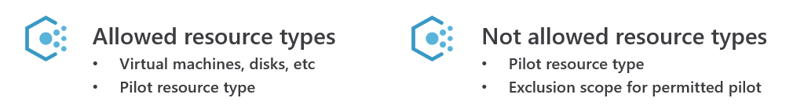

    This alternative approach has the advantage of allowing exceptions that are limited both in the scope at which the exception is granted, and in the type of resource permitted.

    Restricting resources on resource type may not suffice. For example, all VMs share the same resource type, but they differ vastly in costs depending on the VM family and size. Likewise, managed disks are all one resource type, but vary hugely in cost based on the storage type and disk size. Additional policies may be required to obtain adequate control over these resource types.

2. **Design:** How can you prevent accidental deletion of production resources, by administrators who require access to manage those resources?

    **Solution:** There are two ways to prevent accidental resource deletion: resource locks, and blueprints.

    Azure resource locks are used to 'lock' a resource against accidental changes. There are two types of lock: 'Read Only' locks prevent all changes. 'Do Not Delete' locks allow a resource to be modified, but not deleted.

    Azure resource locks can be assigned at the subscription, resource group, or resource level (they cannot be assigned at management group scope). They apply to all resources within that scope. For example, a 'Do not delete' lock on a resource group prevents any resource in that resource group from being deleted but does not impact resources in other resource groups.

    Any attempt to delete or modify a resource that is subject to a 'Read Only' lock will fail, as will attempts to delete a resource subject to a 'Do Not Delete' lock. The lock must first be removed, then re-created if necessary, once the change has been made.

    Creating and deleting resource locks requires dedicated RBAC permissions. These are included in the 'Owner' role, but not the 'Contributor' role. They can be assigned using the 'User Access Administrator' role.

    Another way to prevent accidental resource modification or deletion is to deploy the resources using an Azure blueprint. Each blueprint assignment can optionally lock the blueprint resources. Again, two lock types are supported, 'Do Not Delete' and 'Read Only'. In this case, the **only** way to change or delete the resources is by deploying an updated version of the blueprint. Even the subscription owner cannot override blueprint locks.

    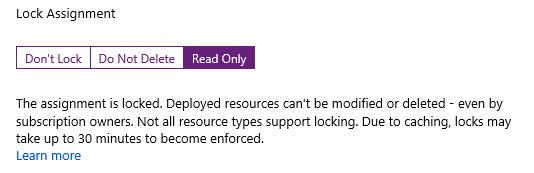

3. **Design:** How can Enterprise IT enforce a company-wide resource naming convention?

    **Solution:** A naming convention can be implementing using Azure Policy to restrict the names of each resource created.

    ```json
    {
        "if": {
            "allOf": [
                {
                    "field": "type",
                    "equals": "Microsoft.Compute/virtualMachines"
                },
                {
                    "not": {
                        "field": "name",
                        "like": "*-vm"
                    }
                }
            ]
        },
        "then": {
            "effect": "deny"
        }
    }

    ```

   The above example shows how to enforce a simple naming constraint on a single resource type -- virtual machines. Enterprise IT need to enforce their convention across all their resource types. Implementing this in a single policy requires an impractically large conditional logic in the policy rule.

   Instead, separate policies should be created for each resource type. These policies should then be combined into a single *policy initiative.* Using a policy initiative allows the entire set of policies to be assigned in a single operation. It also allows new naming rules to be added easily---simply add the new rule to the initiative and it will be applied across all existing assignments.

*Identity Baseline* <!-- omit in toc -->

1. **Design:** How can you delegate access management to business units for each application they own, while protecting other applications and ensuring that controls implemented by the Cloud Governance teams cannot be circumvented?

    **Solution:** This can be achieved using Azure role-based access control (RBAC). Create a group in Azure AD for that business unit, for example, BU1-Azure-Managers, and add those users to the group. Add the Azure AD group to the contributor role and assign that role to the subscription used by the business unit. A similar approach can be used for sub-units or teams within the business unit, assigning the contributor role to either dedicated subscriptions or individual resource groups.

    Contributors do not have permissions to add or remove users or change policies. They are also unable to move a subscription between management groups. Hence, they cannot override controls defined by the Cloud Governance team.

2. **Design:** How can you ensure staff have access to what they need, but no more, while enforcing that only built-in roles are used.

    **Solution:** As with the previous question, role-based access control can be used to ensure staff have access to what they need, but no more. Rather than using the general-purpose contributor role, Azure also provides fine-grained roles that grant permission to use specific Azure services. For example, a network engineer may be granted the Network Contributor role, so they can manage network resources only. They might also be granted the Reader role, so they can view, but not modify, the resources using the network.

    To restrict use of RBAC to built-in roles, Azure policy can be used. The following example shows a policy rule which prevents the use of custom roles.

    ```json
    "policyRule": {
        "if": {
            "allOf": [
                {
                    "field": "type",
                    "equals": "Microsoft.Authorization/roleDefinitions"
                },
                {
                    "field": "Microsoft.Authorization/roleDefinitions/type",
                    "equals": "CustomRole"
                }
            ]
        },
        "then": {
            "effect": "deny"
        }
    }
    ```

3. **Design:** Identify a solution to streamline identity management and provide remote access for e-commerce team contingent staff.

    **Solution:** Using Azure AD, contingent staff can be granted access to Azure resources using their existing Azure AD identity, rather than having to create a new identity in the Trey directory. This simplifies identity management.

    Azure resources are managed via Azure resource manager, which means that can be managed from any Internet-enabled location. Access to the Trey premises or network is not require for resource management.

    Using templates and 'infrastructure as code', it is easy to deploy new Dev and Test environments for contingent staff.

    If network access to an existing Trey deployment is required, this can be implemented using a VPN. This can be either a site-to-site VPN from the contingent staff offices to the Trey virtual network, or individual point-to-site VPNs for each contingent staff team member. Access can be limited as necessary using network security groups.

*Deployment Acceleration* <!-- omit in toc -->

1. **Design:** How can Trey implement an 'Infrastructure as Code' approach to deployment automation, while still allowing different footprints in different environments?

    **Solution:** Resource manager templates provide a declarative means to deploy Azure resources. Each template file describes all the resources to be deployed, and Azure takes care of the deployment process. This provides a fully automated way to deploy entire applications, including all networking, storage, compute and other components.

    Template files can be stored and managed similarly to source code, using a repository. This provides a central archive with version control.

    Each template file can be parameterized. These parameters can be used to control details which vary between each deployment, including the deployment footprint (size and number of VMs, etc.). Parameters are specified using parameter files, which are specified together with the template itself at deployment time. These parameter files can also be stored in source control. This allows the same template to be used for different environments, by using a different parameter file to tailor each deployment.

2. **Design:** How can the Cloud Governance team track where their best-practices reference implementations are deployed, and manage updates to those deployments?

    **Solution:** The Cloud Governance team can use Azure blueprints to publish and managed their best-practice reference implementations of common deployments.

    Azure blueprints build on top of Azure templates. Each blueprint specifies a collection of artifacts to deploy---these can include templates, policy, and role-based access control permissions.

    Unlike templates, blueprints are stored and managed inside Azure. They are fully versioned, and each deployment is tracked. This allows you to easily identify all deployments of a blueprint. The blueprint version for each deployment is also tracked, enabling controlled roll-out of updated versions across deployments.

3. **Design:** How can the Cloud Governance team prevent best-practice reference implementation deployments from being modified outside of their control?

    **Solution:** Azure blueprints support locking of deployed resources. There are two types of lock: 'Read Only' and 'Do Not Delete'. These locks prevent the deployed resources from being modified except by deploying an updated version of the blueprint.

    There are no workarounds or backdoors---even the owner of the subscription in which the blueprint has been deployed cannot override the locks imposed by the blueprint.

## Checklist of preferred objection handling

1. Per-subscription configuration won't scale to an organization the size of Trey Research. How can governance controls be implemented with minimum per-subscription configuration overhead?

    Azure subscriptions should be grouped into a management group hierarchy. The root of this hierarchy is the tenant root management group. Under this root, a tree of management groups can be implemented to represent the business units and sub-units within the organization. Each Azure subscription is then assigned to a management group node within this tree.

    Many Azure governance controls be assigned at the management group scope, which means they apply across all subscriptions under that management group node. This enables a single configuration to apply consistently and reliably across many subscriptions.  Supported controls include Azure policy and Azure role-based access control. In addition, Azure Advisor, Security Center, and Activity Logs all support management group views.

2. As well as implementing our governance rules on how Azure is used, we need a way to audit that no deployments have been made that bypass those rules. This audit needs to scale across the entire organization.

    Implement governance rules using Azure Policy and assign those Policies at the root tenant management group scope. This ensures the policy is applied across all subscriptions within the organization.

    As well as controlling resource deployments, Azure policy provides compliance reports to identify any out-of-policy resource. Deploying the policy at the tenant root management group scope provides a single report for all resources in the organization. If more fine-grained reporting is required, this can be achieved by deploying the policy at the appropriate scope.

3. How can we ensure our deployments meet Azure security best practices, and how can we protect our Production workloads even if the security perimeter is compromised?

    Azure Security Center allows you to define your VM security policy, monitor compliance, and receive actionable recommendations on how to implement Azure security best practices. Adaptive Application Controls, available in the Azure Security Center Standard pricing tier, enable you to control whitelists of which executables can run in your Production environments.

4. How can Azure help control the costs associated with non-Production VMs left running out-of-hours?

    DevTest labs, auto-VM shutdown, and the start-stop VM marketplace solution, all offer the ability to automatically shut down VMs.

    Azure Advisor and Azure Cost Management provides additional reports to identify idle VMs and to right-size underutilized VMs.

## Customer quote 

"The governance controls Azure provides allows Trey Research to move forward with a modern enterprise cloud environment knowing that IT still is in control but allows flexibility for our business units to do their job without us in the way."

Ken Greenwald, CTO
