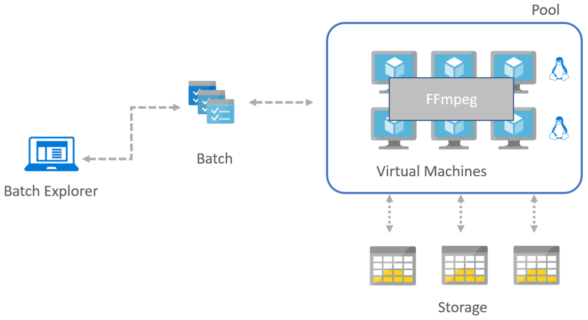

---
lab:
    title: 'High Performance Computing - Model Answer'
---

# Case Study: High Performance Computing - Model Answer

## Preferred solution

_High-level architecture_

1. Without getting into the details (the following sections will address the particular details), diagram your initial vision for handling the top-level requirements for data loading, data preparation, storage, machine learning modeling, and reporting. You will refine this diagram as you proceed.

    After speaking with its support team at Microsoft, ThoughtRender decided that Azure would be the right choice for their platform. They decided to load data into blob storage; explore and prepare it using StorageExplorer and Azure CLI; execute their compute workload with Azure Batch; consider integrations with existing tools and apps their rendering users already have; and visualize and collaborate on remote workstations using Azure NV compute instances, with optional software from third-party providers.

> **Note**: The preferred solution is only one of many possible, viable approaches.

_Data loading_

1. How would you recommend ThoughtRender get their data into (and out of) Azure? What services would you suggest and what are the specific steps they would need to take to prepare the data, to transfer the data, and where would the loaded data land?

    ThoughtRender should consider using the Microsoft Azure Import/Export service, or the Azure Data Box. Data will be loaded on-premises at ThoughtRender to hard drives provided by either service. These hard drives will then be sent to chosen/agreed Microsoft Azure datacenters and data loaded directly to the customer\'s Azure tenant, typically into a Blob storage account. No special preparation of the data may be required, other than whatever file structure may facilitate the customer\'s workflow easiest in Azure (e.g., input and output folders).

_Video and Image Processing_

1. What software tools will be used here? Are they commercial, or Open Source, or a combination of both? Will ThoughtRender need to throw away the tools they are already using, or are some integrations possible?

    Typically, there will be a combination of both Open Source and commercial tools. Open Source tools used for image/video processing include FFmpeg and Blender. Commercial software tools used in rendering may include Maya, RedShift. ThoughtRender does not need to throw away what applications they are using; various levels of integration and support may be available with Azure for their applications, and this should be assessed on an app by app basis. Open Source tools (Linux or Windows based) are welcome and usable on Azure.

2. For Linux based tools, does it matter which flavor of Linux is chosen?

    Typically, yes, it is a good idea to check the (1) flavor/distribution and (2) version of Linux that is being used to support the applications (e.g., CentOS, version 7.2). There may be multiple versions of Linux in use at the customer for different applications, but this may also be due to lack of maintenance/organization, in which case it could be a good opportunity to help standardize on a single distribution/version to use in this Azure project, as long as their chosen applications support it.

3. When are these tools used at ThoughtRender? Are they part of a workflow?

    Typically, all of these software tools are used as part of a \"workflow\" at the company (i.e., from idea to finished project), and it is important to know at which part of the workflow the tool is used, and how this may fit with other applications. This may be important, for example, for understanding data transfer/flow. The output from one application may need to be stored on storage, which is shared, to be used as input for another application. A typical Video Production pipeline (including some typical software tools) is as in the following diagram:

_Batch Computing_

1. What technology would you recommend ThoughtRender use for implementing their rendering compute workloads in Azure?

    Azure Batch Rendering, a combination of IaaS compute resources, managed by Azure Batch (i.e., to start/stop compute resources to complete a rendering workload), and integrated where possible with software rendering tools such as Blender or Maya.

2. Are there particular types of compute instances you would guide ThoughtRender to use?

    Rendering is a compute-heavy activity (physics calculations used to simulate light passing to/through objects in 3D), with a requirement for fast storage to read/write individual frames of video as the rendering activity works through a sequence of video. Frames (i.e., the input/output data for the physics calculation) can be easily \"split up\" between compute nodes and are not dependent on each other. This means there is typically little requirement for specialized (i.e., Infiniband) networking for inter-communication during the render.

3. Are compute-intensive, memory-intensive, disk-intensive, or network-optimized instances needed?

    Compute-intensive instances (e.g., H16, A9) are needed. Fast SSD disk, or \"medium\" memory sizes may be required, depending on the software used. Special networking is not typically required.

4. Are GPU based instances needed?

    If the software involved natively makes use of GPUs (e.g., Commercial software RedShift), then yes, these could be needed; typically, the NC series (i.e., NVIDIA GPU \"compute\" focused instances). Otherwise, typically, GPUs are not needed.

5. How would you guide ThoughtRender to load data so it can be processed by the rendering compute workload?

    Typically, the data should be loaded into a \"fast\" storage share (e.g., perhaps a BeeGFS or Lustre Parallel File System) as it may be read/written to in parallel by multiple compute nodes at the same time during rendering. Performance of this storage will be key to the overall completion time for rendering. For standard image processing, if the images or frames can be contained within storage on a compute node, then an ordinary storage share (e.g., SMB) can be used from which to load the data. Then the local SSD storage on the compute node can be used during the actual compute processing, with output written back to the SMB share at the end of the processing.

6. How will this data be used at the beginning, middle, and end of a compute workload?

    Typically, initial input data may first be made available on a file share (e.g., SMB). Compute nodes, during a compute workload, may copy this data to local disk, and then process against local disk during the workload. At the end of the workload, the resulting data (or changed data) can be saved back to the same initial file share, or an alternative file share. It is always a good idea to double-check details of the exact workload during design.

7. Where will this data be stored?

    Typically, data can be stored on a file share (e.g., SMB). During a compute run, it may be more practical and performant to copy/store this data on a parallel filesystem (e.g., Lustre or BeeGFS), or to local SSD disk on the compute nodes, typically described as "scratch" disk.

8. Will this data be stored on compute instances during a batch run? Would you store data on each compute node working in a batch, or would you store data in a shared area?

    The answer depends on the workload. For compute rendering, it may be best to store the data in a shared area (i.e., parallel filesystem or SMB storage share). For image processing, data during a batch run may be OK to be stored on local SSD disk attached to the compute nodes -- used only for the duration of the batch workload.

9. What sort of performance will be required from this storage?

    It is a good idea to check/benchmark this against what the customer currently uses. However, overall, the storage used should be able to "feed" all of the compute nodes for the duration of the run, such that the compute cores on the compute nodes are fully utilized.

10. Will this data need to be backed up or archived?

     Data during a compute run is typically referred to as "scratch" data, and may not be needed after the compute run, and can be discarded. Care should be taken that the output of the compute run is stored/saved elsewhere before the "scratch" storage used during the compute run is destroyed. Depending on the use case, it may be practical to "archive" all of the compute run data, including the interim data normally thrown away -- this may save time to recall later if a project needs to be re-done.

_Operationalizing and Integrating_

1. Is it possible for ThoughtRender to connect their Batch Rendering workloads in Azure, to their Rendering workloads on-premises, in their various sites? If so, will the connection be made at a networking level, an operating system level, or an application level?

    Yes, typically, this is possible. The connection is typically made at the application level (assuming a network connection such as VPN is already in place). Check what type of HPC compute cluster that ThoughtRender uses on-premises, and check the scheduling and batch software they use on those systems. Some of these software (e.g., HPC Pack, IBM LSF, Slurm, Univa GridEngine) have integrations possible with Azure to allow \"bursting\" (i.e., keeping head node control on-premises, and sending compute jobs to compute nodes running on Azure -- basically extending the on-premises HPC cluster into the cloud).

2. Is it possible for ThoughtRender to keep their Azure infrastructure separate (i.e., completely unconnected) to their on-premises HPC clusters?

    Yes, this is typically possible and is usually easier than configuring a \"burst\" connection or integration with existing on-premises software. Separate clusters can be created in Azure, and configuration easily repeated or applied using Azure ARM templates, or using CycleCloud software.

_Visualization and Remote Workstations_

1. Are special types of compute instances needed for remote workstations in Azure?

    Yes, the "NV" (NVIDIA Visualization) compute instances should be used. These contain special NVIDIA GRID technology graphics cards (e.g., NVIDIA M60), specialized for visualizations and remote workstation use.

2. Is a special type of software required for client access? Could users simply use remote desktop? Would this perform the way ThoughtRender (or their customers) would like it to?

    This depends on the applications and users involved. But typically, for \"high end\" workstation users (i.e., who may already use high powered workstations with GPUs installed), specialized software is needed for best performing remote desktop technology. Example: for interacting with 3D models in a performant way, a \"low latency\" is needed for usable interaction. Partner solution software and technology in this space includes Teradici and Citrix HDX. This software has already been proven in such scenarios for other customers. Teradici uses \"PCoIP\" (PC over IP) technology, which sends only \"changed\" pixels between workstation and display. A physical thin client connected to large monitors, or a software client installed on, e.g., a laptop connected to large monitors can be used as a remote desktop client.

3. Would it be secure?

    Yes, Teradici PCoIP technology sends only "changed" pixels from the workstation to display, and encrypts the pixels during transfer.

4. Would it be color correct?

    Teradici ensures color correctness, which may be important for some types of users.

5. Would it perform?

    The idea to use specialized software (e.g., like Teradici or Citrix HDX) is typically driven by the need to perform and perform better than typical remote desktop.

6. Would it allow collaboration or interactivity?

    Not all specialized software may facilitate collaboration (i.e., multiple users sharing a screen), and not all software will provide the \"low latency\" needed to interact with the software in a performant way for the users involved. Different software solutions provided by our partners cover some or all of these scenarios in different ways.

## Checklist of preferred objection handling

1. Will Azure give us control to schedule jobs when we want?

    Yes. With Azure Batch, jobs can be queued as normal, or sent to a queue and completed at desired times of the day.

2. Will the capacity be available on Azure when we want it?

    Typically, yes! This is the benefit of using a large public cloud provider with resources at scale. However, firstly, there are default limits for specific resources in an Azure subscription, which can easily be removed upon request. Secondly, for specialized compute instances, currently, there may be restrictions in certain datacenter locations, at particular scales. See public SLAs on the Microsoft website regarding our service delivery, and consult your local HPC specialists at Microsoft if you have any concerns regarding the scale/type of your workload.

3. We heard Microsoft does Linux now. But how true is this? Will it work with our chosen Linux version?

    Yes. Microsoft loves Linux! A commitment has been made by Microsoft to make Linux (and wider Open Source technologies) "a first-class citizen" on Azure. Microsoft has relationships with the major Enterprise Linux vendors (i.e., Red Hat, SUSE, Canonical), at various levels and teams, and specific integrations. For example, Microsoft and Red Hat have a relationship (2017) such that you can call Microsoft with a Red Hat query, and have this handled by Red Hat support staff working in Microsoft support centers. You can choose to run Azure Marketplace images of various Linux distributions/versions, and you can also BYOL (Bring Your Own License) for Enterprise Linux versions you own.

4. We have petabytes of data on-premises. It would cost us a fortune and take ages to move this to the cloud!

    Yes, this can pose an issue. However, there are various methods of transferring data. In the first instance, if copying data over a standard Internet connection does not perform (e.g., direct or with VPN), a dedicated connection to Azure (ExpressRoute) may help. Secondly, optimized tools exist for transferring data with huge performance improvements. This includes AzCopy (an open source tool from Microsoft), or commercial tools such as Signiant, Aspera, or FileCatalyst. These tools, in combination with dedicated connections, may provide fast enough alternatives in given time frames. Thirdly, dedicated services exist for bulk transfers of large data, such as the Azure Data Box. This involves shipping hard drives of data from your data center to Microsoft data centers. Finally, if it is possible to start with the data in Azure, then the cost of moving is substantially reduced, and perhaps this may be possible for new projects starting from scratch (and, e.g., for old projects to remain on-premises).

5. We heard collaboration is possible for 3D imaging workstations. But we have very specific color requirements and buy top-end workstation equipment for our users. Our users just wouldn't get the interaction performance they require with something \"remote\" in the cloud.

    With specific software tools from our partners such as Teradici, specialized solutions exist for exactly this requirement.

6. Will this take jobs away from our IT system administrators and HPC engineers?

    No. IT system administrators can still maintain the systems in Azure, giving the users and the business insight via monitoring, logs, and can more easily respond to requests for new systems. HPC engineers can focus on taking advantage of the latest technologies in Azure to improve performance.

## Customer quote (to be read back to the attendees at the end)

"With High Performance Computing power via Azure at our fingertips, we can control our delivery -- large or small, slow or fast -- for our customers, as well as allowing our team to collaborate and share better, focusing less on fixing hardware, and more on thinking and rendering!"

Thomas Pix, CIO of ThoughtRender
