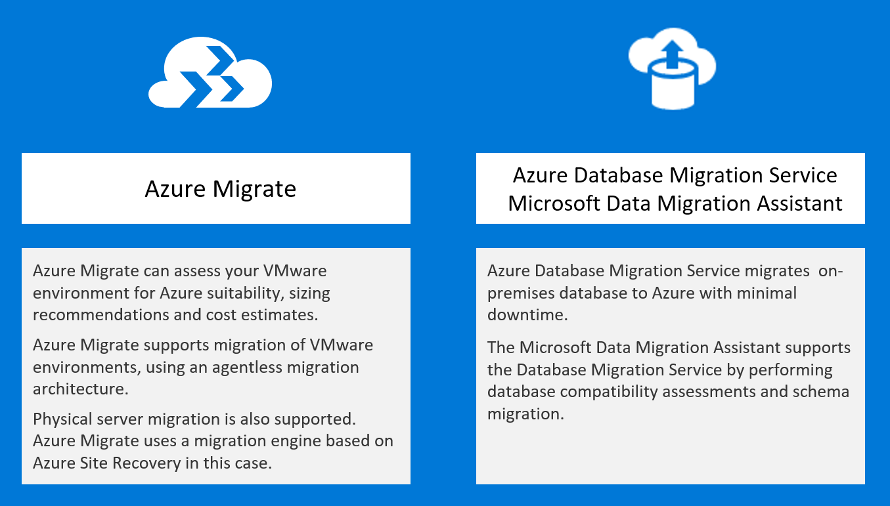

---
lab:
    title: 'Business continuity and disaster recovery'
---

# Case Study - Line-of-business application migration

**Contents**

<!-- TOC -->

- [Line-of-business application migration whiteboard design session student guide](#line-of-business-application-migration-whiteboard-design-session-student-guide)
  - [Abstract and learning objectives](#abstract-and-learning-objectives)
  - [Step 1: Review the customer case study](#step-1-review-the-customer-case-study)
    - [Customer situation](#customer-situation)
    - [Customer needs](#customer-needs)
    - [Customer objections](#customer-objections)
    - [Infographic for common scenarios](#infographic-for-common-scenarios)
  - [Step 2: Design a proof of concept solution](#step-2-design-a-proof-of-concept-solution)
  - [Step 3: Present the solution](#step-3-present-the-solution)
  - [Wrap-up](#wrap-up)
  - [Additional references](#additional-references)

<!-- /TOC -->

#  Line-of-business application migration whiteboard design session student guide

## Abstract and learning objectives 

In this whiteboard design session, you will look at how to design an Azure migration for a heterogenous customer environment. The existing infrastructure comprises both Windows and Linux servers running on both VMWare and physical machines, and includes some legacy servers. Throughout the whiteboard design session, you will look at the various options and services available to migrate heterogenous environments to Azure.

At the end of this workshop, you will be better able to design and implement the discovery and assessment of environments to evaluate their readiness for migrating to Azure using services including Azure Migrate and Azure Database Migration Service.

## Step 1: Review the customer case study 

**Outcome**

Analyze your customer's needs.

Timeframe: 15 minutes

Directions:  With all participants in the session, the facilitator/SME presents an overview of the customer case study along with technical tips.

1.  Meet your table participants and trainer.

2.  Read all of the directions for steps 1-3 in the student guide.

3.  As a table team, review the following customer case study.

### Customer situation

Fabrikam Fabrics is a major manufacturer and distributor of clothing and soft furnishing materials. Founded in 1972 and based in Columbus, Ohio, their business comprises three major product families (clothing, upholstery, and technical fabrics). Customers comprise familiar brand-name clothing manufacturers and furniture manufacturers, and also includes large-scale uniform suppliers to the US military. Turnover in 2018 exceeded 350 million USD.

The CTO, James Lynch, was hired 6 months ago from outside the company, with a mandate to address ever-increasing IT costs. He has identified a sprawling IT estate, including a substantial legacy server footprint. New servers and services have been accumulated over time, without consolidating existing infrastructure. This includes:
- Windows servers including both x32 and x64 hardware running Windows Server 2003 through to 2016.
- Linux servers running a mix of RHEL 6.10 and 7 series (7.2 through 7.6) and Ubuntu 16.04.
- The above servers comprise both physical machines as well as VMs hosted on VMware infrastructure managed by vCenter 6.5.
- Multiple database engines, including Microsoft SQL Server, PostgreSQL, and Cassandra.

In total, 448 servers and VMs have been identified to date, distributed across 5 main locations, all in the US. There is a complex web of dependencies between servers and no-one has a clear view of the entire estate. Fear of breaking an existing system has been one of the drivers of server count and sprawl.

To address this, James has proposed to the board that Fabrikam should migrate as much of the existing IT infrastructure as possible to the cloud. As well as eliminating IT infrastructure overheads, this will be an opportunity to 'clean house' and create a modern, fit-for-purpose IT environment, as well as realizing substantial cost savings relative to their current infrastructure. The board have agreed, and Microsoft Azure has been selected as the cloud provider.

### Customer needs 

1.  Identify which servers (physical and virtual) can be migrated to Azure, and what modifications (if any) are required.
   
2.  Create a road map of prioritized migrations, accounting for ease of migration and dependencies.

3.  Where suitable, migrate existing servers and databases to Azure as efficiently as possible.
   
4.  Where existing servers cannot be migrated, identify alternative migration strategies (refactor, re-architect, etc.) and their pros/cons.
   
5.  Prior to migration, accurately forecast the costs associated with each migrated workload, including any third-party licensing costs.
   
6.  Post-migration, be able to track costs, control usage, cross-charge business owners, and identify cost-saving opportunities.
   

### Customer objections 

1.  Owners of each business application need to approve any substantial application change, including migration. Business owners have indicated that they will require evidence that migration will be successful before granting approval.

2.  Fabrikam have negotiated an Enterprise Agreement (EA) with Microsoft for their Azure consumption. Any cost estimates need to reflect their EA discount.

3.  Many applications comprise multiple components or tiers. How can you ensure that these migrations are appropriately orchestrated?
   
4.  To reduce business impact, each migration should be designed to minimize application downtime. In addition, to reduce risk, there must be an option to fail-back should the migration experience an unexpected problem.

5.  We are expecting to move all our existing infrastructure to Azure. Reducing our on-premises server costs should provide substantial cost savings. Can you confirm what savings we can expect?

### Infographic for common scenarios

## Step 2: Design a proof of concept solution

**Outcome**

Design a solution and prepare to present the solution to the target customer audience in a 15-minute chalk-talk format.

Timeframe: 60 minutes

**Business needs**

Directions: With all participants at your table, answer the following questions and list the answers on a flip chart:

1.  Who should you present this solution to? Who is your target customer audience? Who are the decision makers?

2.  What customer business needs do you need to address with your solution?

**Design**

Directions: With all participants at your table, respond to the following questions on a flip chart:

*Migration Assessment*

1.  How can Fabrikam assess their existing infrastructure for migration to Azure? Provide options for VMware VMs, physical servers, and databases.

2.  How can Fabrikam identify dependencies between their existing servers? How can they use this information in their migration planning?
   
3.  What criteria should Fabrikam use to prioritize their migrations when building a migration road map?
   
4.  What options can you suggest to migrate workloads whose current infrastructure is not suitable for a lift-and-shift migration to Azure? 

*Migration Execution*

1.  What Azure components or configurations should be deployed prior to migration?

2.  What tools are available for migration execution? Provide options for VMware VMs, physical servers, and databases.
   
3.  What post-migration steps should be carried out for business-critical applications migrated to Azure?

*Cost management and optimization*

1.  How can Fabrikam estimate the future cost before a workload is migrated to Azure?
   
2.  How can Fabrikam optimize their cost estimate, prior to migration?
   
3. How can Fabrikam analyze and optimize their costs, post-migration? Include details of mechanisms for internal charge-back.

**Prepare**

Directions: With all participants at your table:

1.  Identify any customer needs that are not addressed with the proposed solution.

2.  Identify the benefits of your solution.

3.  Determine how you will respond to the customer's objections.

Prepare a 15-minute chalk-talk style presentation to the customer.

## Step 3: Present the solution

**Outcome**

Present a solution to the target customer audience in a 15-minute chalk-talk format.

Timeframe: 30 minutes

**Presentation**

Directions:

1.  Pair with another table.

2.  One table is the Microsoft team and the other table is the customer.

3.  The Microsoft team presents their proposed solution to the customer.

4.  The customer makes one of the objections from the list of objections.

5.  The Microsoft team responds to the objection.

6.  The customer team gives feedback to the Microsoft team.

7.  Tables switch roles and repeat Steps 2-6.

##  Wrap-up 

Timeframe: 15 minutes

Directions: Tables reconvene with the larger group to hear the facilitator/SME share the preferred solution for the case study.

##  Additional references

|    |            |
|----------|:-------------:|
| **Description** | **Links** |
| Azure migration hub  | https://azure.microsoft.com/migration/  |
| Azure Migrate  | https://azure.microsoft.com/services/azure-migrate/  |
| Azure Database Migration Guide  | https://aka.ms/datamigration  |
| Microsoft Data Migration Assistant (DMA) | https://docs.microsoft.com/sql/dma/dma-overview?view=sql-server-2017 |
| Azure Data Migration Service | https://azure.microsoft.com/services/database-migration/ |
| Azure SQL Database | https://azure.microsoft.com/services/sql-database/ |
| Azure billing hub | https://docs.microsoft.com/azure/billing/ |
| Azure cost management | https://azure.microsoft.com/services/cost-management/ |
| Azure governance | https://azure.microsoft.com/solutions/governance/ |
| Azure advisor | https://azure.microsoft.com/services/advisor/ |
| Azure enterprise scaffold | https://docs.microsoft.com/azure/architecture/cloud-adoption/appendix/azure-scaffold |
| Azure virtual datacenter | https://docs.microsoft.com/azure/architecture/vdc/ |
| Building a cloud migration business case | https://docs.microsoft.com/azure/architecture/cloud-adoption/business-strategy/cloud-migration-business-case |
