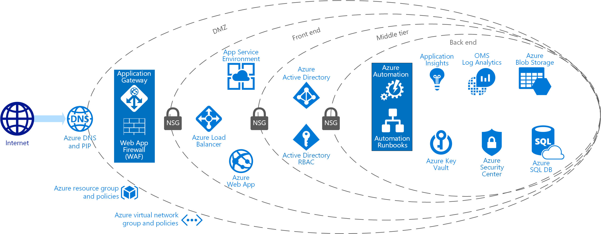

---
lab:
    title: 'Securing PaaS'
---

# Case Study - Securing PaaS

**Contents**

<!-- TOC -->

- [Securing PaaS whiteboard design session student guide](#securing-paas-whiteboard-design-session-student-guide)
    - [Abstract and learning objectives](#abstract-and-learning-objectives)
    - [Step 1: Review the customer case study](#step-1-review-the-customer-case-study)
        - [Customer situation](#customer-situation)
        - [Customer needs](#customer-needs)
        - [Customer objections](#customer-objections)
        - [Infographic for common scenarios](#infographic-for-common-scenarios)
    - [Step 2: Design a proof of concept solution](#step-2-design-a-proof-of-concept-solution)
    - [Step 3: Present the solution](#step-3-present-the-solution)
    - [Wrap-up](#wrap-up)
    - [Additional references](#additional-references)

<!-- /TOC -->

# Securing PaaS whiteboard design session student guide

## Abstract and learning objectives 

In this Case Study, you will work with a group to design an end-to-end PaaS solution that combines many of Azure's security features, while protecting sensitive data from both internal and external users.

At the end of this Case Study, you will be better able to design secure PaaS-based solutions that protect your systems and data from both internal and external threats.

## Step 1: Review the customer case study 

**Outcome**

Analyze your customer's needs.

Timeframe: 15 minutes

Directions: With all participants in the session, the facilitator/SME presents an overview of the customer case study along with technical tips.

1.  Meet your table participants and trainer.

2.  Read all of the directions for steps 1-3 in the student guide.

3.  As a table team, review the following customer case study.

### Customer situation

Fourth Coffee is an American coffeehouse chain that was founded in Seattle, Washington in 1970. It currently operates over 20,000 locations worldwide.

Victoria Gray, CEO of Fourth Coffee, has established a mandate to revamp their loyalty program that starts with their platform. Currently they provide gift cards that customers can purchase in-store and use at any of their locations. These gift cards can be "re-loaded" with funds by payment by the customer as an in-store transaction. Other than tracking the serial number of the gift card, its balance and purchase history, Fourth Coffee does not have any direct way to associate the purchase history with the customer. They feel this is a big opportunity for them to address, and in doing so will enable them to launch their worldwide customer loyalty program.

They would like to enable their customers to register online to associate any gift cards with their profile. Customers should be able to self-manage their gift card collection, check balances and in the future, receive loyal customer benefits like free coffees or offers to try some of the newest bakery items. At this time, Fourth Coffee is not concerned with enabling customers to "re-load" their cards online. In addition to gift card management, Fourth Coffee would like to enable logged-in users to provide reviews about Fourth Coffee products. They like the idea of coupling reviews to actual gift card users and see a future in which they might reward frequent reviewers with bonus funds on their registered gift cards. These reviews would need to be publicly available and free-text searchable from the website.

In designing and implementing this solution, Fourth Coffee is very concerned about security. They had already launched a customer profile microsite alongside their primary website in Azure using Azure App Services, they host the website in a Web App and all logic is provided thru an API App. They would like to keep this core approach for the gift card website but extend it as appropriate with other Azure PaaS services.

The current customer profile microsite is built with ASP.NET Identity Providers and stores the customer logins and passwords in Azure SQL Database. This was sufficient when the only functionality this site provided was effectively opt-in/out of promotional emails. Now that they will be storing more sensitive information about the customer, they would like to revisit this approach.

A primary concern for Fourth Coffee is figuring out how to secure access to this sensitive data, particularly to limit and control access by their developers. They have put together a "solution security" team who works in the office of the CISO (Chief Information Security Officer) that should be the only group allowed to view the secrets and keys used in production. The developers have expressed concern that this separation of duties, while admirable, is not possible and will prevent them from getting their job done or make it difficult to troubleshoot issues in production.

In addition to securing access to sensitive data, they would like to gain visibility into the security health of their solution. They need guidance on how to they should make sense of all the logs, events and metrics available from the Azure services and are curious if there is anything that can help them monitor their security posture and identify potential issues automatically.

They would like to start designing a pilot solution for one region, that if successful, they could deploy globally down the road.

### Customer needs 

1.  Safeguard and manage identity of users and services.

2.  Detect and respond to identity-based threats.

3.  Detect and respond to threats to their applications and solutions.

4.  Gain visibility into security health.

5.  Secure the loyalty data at rest and in transit. Allow access only to those who have a need.

6.  They want to achieve the right balance of security versus complexity.

7.  Security centered around PaaS services. 

 ### Customer objections 

1.  Can we really set it up, so our developers' applications have access to the connection strings, keys and other secrets at run time, without enabling the developers themselves to access this sensitive data?

2.  We've been told over and over again that Azure's services, like Azure SQL Database and Azure Storage, must always have a public endpoint. Is that really true?

3.  We heard the announcement about Managed Service Identity. We recognize it is in preview now, but we would like to understand how it would improve the security of the solution you are recommending to us.

4.  We need to be certain that all of our data is encrypted when it is stored on disk, is that possible with the PaaS services you are recommending?

### Infographic for common scenarios

## Step 2: Design a proof of concept solution

**Outcome**

Design a solution and prepare to present the solution to the target customer audience in a 15-minute chalk-talk format.

Timeframe: 60 minutes

**Business needs**

Directions:  With all participants at your table, answer the following questions and list the answers on a flip chart:

1.  Who should you present this solution to? Who is your target customer audience? Who are the decision makers?

2.  What customer business needs do you need to address with your solution?

**Design**

Directions: With all participants at your table, respond to the following questions on a flip chart:

*High-level architecture*

1.  Without getting into the details, (the following sections will address the particular details), diagram your initial vision for handling the top-level requirements for the gift card website, gift card API, and the storage for customer profiles and transactions. You will refine this diagram as you proceed.

2.  What data would you consider sensitive in this scenario? Is there a compliance standard that you would recommend Fourth Coffee consider building their solution against?

*Securing customer identity*

1.  Fourth Coffee mentioned a desire to improve how they manage and store the identities of their customers, for use when granting them access to their online profiles. What approach would recommend they take to modernize their identity management?

2.  Would the approach you suggested still allow customers who do not want to use social accounts to create a login with Fourth Coffee?

3.  One of Fourth Coffee's biggest frustrations with their existing identity management approach is that when customers forget their password, they typically must contact support, which is an expensive interaction for Fourth Coffee. How would your proposed solution improve this situation? What would be the process?

*Securing the core website components*

1.  The Fourth Coffee website should be publicly accessible, but the gift card API should not be accessible from the Internet. Additionally, all traffic flowing through to the website should pass through some kind of firewall to guard against malicious requests like cross-site scripting and SQL injection, and the website itself should never be directly accessible in any other way. How would you accomplish this?

2.  Fourth Coffee does not like the fact that their existing SQL Database deployment, which contains sensitive customer personally identifiable data (PII), has an endpoint that is accessible on the Internet. They have the firewall rules configured on the SQL Database Server to restrict access, but they would prefer a solution that does not have such a publicly exposed endpoint. What would you suggest and how would they accomplish this?

3.  Fourth Coffee is storing customer purchase history for the long term in Azure Storage blobs. Like their previous concern, they would like to know if they could remove the public endpoint access from Azure Storage, since the transaction data reflects sensitive financial transaction information.

4.  The existing API App is deployed with the connection string information to the SQL Database saved in the web.config. Fourth Coffee would like to improve the handling of sensitive configuration. What would you recommend they do and how would they need to change their app to support your recommendation?

*Enabling reviews*

1.  Fourth Coffee wants to be certain that their mini-platform for reviews can scale and are less concerned about securing the data (other than securing access to edit the reviews appropriately). How would you suggest Fourth Coffee deploy the logic for managing and navigating reviews, how would reviews (which could grow to become very large data sets) be stored?

2.  Fourth Coffee would like users to be able to search across reviews with free-form text, but also narrow their search by product, date range and number of stars. How would you enable end-users to search thru reviews?

3.  How would you secure access to the services you propose in support of reviews?

*Securing DevOps*

1.  Fourth Coffee is trying to think about the complete security of their solution, and one challenge they face is in securing how developers interact with production systems for the purposes of deployments as well as troubleshooting. How would restrict deployments to production Web App or API app from occurring across Internet available endpoints?

2.  With this safeguard in place, how will developers perform their deployments?

3.  They would also like to restrict what developers can see in the database (in terms of sensitive data like gift card data), what options do they have for this?

*Monitoring security health*

1.  What services would you suggest Fourth Coffee utilize in order to monitor the general health of the solution?

2.  What service would you suggest Fourth Coffee utilize to monitor the security health of the solution? What it would it provide for their solution?

**Prepare**

Directions: With all participants at your table:

1.  Identify any customer needs that are not addressed with the proposed solution.

2.  Identify the benefits of your solution.

3.  Determine how you will respond to the customer's objections.

Prepare a 15-minute chalk-talk style presentation to the customer.

## Step 3: Present the solution

**Outcome**

Present a solution to the target customer audience in a 15-minute chalk-talk format.

Timeframe: 30 minutes

**Presentation**

Directions:

1.  Pair with another table.

2.  One table is the Microsoft team and the other table is the customer.

3.  The Microsoft team presents their proposed solution to the customer.

4.  The customer makes one of the objections from the list of objections.

5.  The Microsoft team responds to the objection.

6.  The customer team gives feedback to the Microsoft team.

7.  Tables switch roles and repeat Steps 2-6.

##  Wrap-up 

Timeframe: 15 minutes

Directions: Tables reconvene with the larger group to hear the facilitator/SME share the preferred solution for the case study.

##  Additional references

|    |            |
|----------|:-------------:|
| **Description** | **Links** |
| A reference architecture for building a solution that enables PCI compliance using Azure PaaS services   | <https://docs.microsoft.com/en-us/azure/security/blueprints/payment-processing-blueprint>  |
|   Securing Azure Key Vault - Documentation on how to separate management and data access capabilities when securing Key Vault | <https://docs.microsoft.com/en-us/azure/key-vault/key-vault-secure-your-key-vault>   |
|  Describes how Cosmos DB is secured     | <https://docs.microsoft.com/en-us/azure/cosmos-db/database-security>   |
| How to configure a WAF for an ASE v2 environment   |  <https://docs.microsoft.com/en-us/azure/app-service/environment/app-service-app-service-environment-web-application-firewall>  |
|  VNET Service Endpoints  |  <https://azure.microsoft.com/en-us/blog/announcing-virtual-network-integration-for-azure-storage-and-azure-sql/>   |
